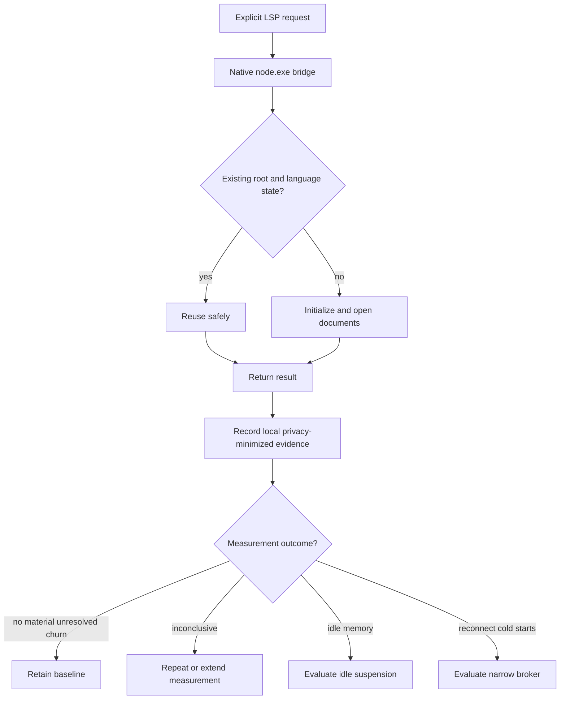

# LSP Bridge Process Reuse and Lifecycle Baseline - Plan

This document records the design debate, the evidence used to resolve it, and the resulting requirements-only scope for reducing LSP bridge churn without creating a new always-on service. It is a decision record and product contract, not an implementation checklist.

## Goal Capsule

- **Objective:** Restore reliable explicit LSP bridge behavior while reducing avoidable machine load and preserving seamless Codex use.
- **Product authority:** Codex users invoke LSP capabilities without selecting, attaching to, or managing processes.
- **Chosen direction:** Staged A-plus/C-first hybrid: use the reliable native Node runtime, keep automatic diagnostics disabled during measurement, preserve safe in-process reuse, batch any future hook invocation, and measure before adding idle suspension or a broker.
- **Open blockers:** The representative observation window, materiality thresholds, and local diagnostic-artifact retention rules must be settled before baseline results can authorize deeper lifecycle work. Launcher repair and explicit-capability validation are not blocked by those measurement decisions.

## Context and Motion

The original question was whether the LSP bridge should reuse one process instead of repeatedly launching Node processes, and whether unused processes should be stopped automatically. The broader machine investigation found that the current large `node_repl.exe` population belongs to Codex's internal Code Mode host, not to the LSP bridge. The LSP bridge currently has no active language-server process population to optimize in the observed snapshot.

The motion debated was:

> Choose the safest high-impact design for reducing Codex/LSP process churn and idle load while preserving seamless LSP capability and a reversible path to deeper reuse.

The decision criterion was measured machine-load reduction per unit of lifecycle risk. The debate treated the internal Code Mode host as a separate workstream and did not attribute its processes to the bridge.

## Debate Record

### Fact sheet

- The bridge keeps one manager per resolved workspace root in `src/index.ts` and one provider per language in `src/core/lsp-manager.ts` during one live bridge process.
- The bridge starts a language-server child lazily and intentionally shuts it down when the bridge is disposed.
- The PostToolUse hook can collect up to five files and launch a fresh bridge CLI once per file.
- The PostToolUse hook is currently disabled in the user's Codex configuration.
- The live bridge configuration points to a missing versioned Node executable.
- Bare `node` currently resolves first to `Documents\Codex\bin\node.cmd`; the reliable native runtime is `C:\Users\JackKenter(Intern)\AppData\Local\Programs\node-portable\node.exe`.
- `node_repl.exe` is a specialized Codex runtime with `NODE_REPL_*` variables, browser services, and native-pipe settings. It is not the bridge's documented standard Node launcher.
- The process snapshot found no active bridge or language-server processes and 39 `node_repl.exe` processes tied to the separate internal Code Mode host.
- MCP stdio uses a client-launched server subprocess. MCP lifecycle separates initialization, operation, and shutdown and recommends bounded request timeouts.

### Proposals considered

| Proposal | Core idea | Main benefit | Main cost or risk |
|---|---|---|---|
| A — In-process reuse first | Repair the launcher, batch the hook, harden lifecycle/concurrency, and add guarded idle suspension if measurements justify it. | High-confidence improvement without a new persistent service. | It cannot reuse state across short-lived MCP connections. |
| B — Persistent broker | Add a per-user or per-workspace broker that survives MCP connections and isolates root, language, and client state. | Only option that can amortize cold starts across MCP connections. | IPC, security, recovery, stale-state, shutdown, and persistent idle-process complexity. |
| C — Fast-mode simplification | Keep automatic diagnostics off, retain explicit MCP diagnostics, and defer lifecycle expansion. | Lowest operational risk and cleanest Zoom-time posture. | It does not address future hook amplification and may reduce automatic feedback. |
| A-plus/C-first hybrid | Repair the explicit path, keep automatic diagnostics off while measuring, preserve current reuse, require batching before hook reactivation, and gate all deeper reuse on evidence. | Best balance of reversibility, seamless use, and provable next decisions. | Immediate whole-machine improvement may be limited because current bridge load is unproven. |

### Cast and roles

- **Technologist:** advocated A and tested process boundaries, state isolation, lifecycle correctness, and the smallest buildable change.
- **Operator:** advocated C and tested Zoom-time stability, user-facing smoothness, cold-start friction, and operational simplicity.
- **Contrarian:** advocated B and tested whether cross-connection reuse was the only path to material savings.
- **Chair:** opened for the staged A-plus position and required evidence before a broker.
- **Final arbiter:** `sol-med`, as requested. The arbiter selected the staged A-plus/C-first hybrid.

### Round 1 — independent openings

#### Technologist opening — A

The strongest case for B is that MCP stdio is client-launched: if Codex repeatedly creates and disposes MCP connections, the existing bridge cannot share warm language-server children across those boundaries. The strongest case for C is that the PostToolUse hook can launch up to five fresh bridge CLI processes for one tool event, while explicit diagnostics preserve an escape hatch. **Conceded:** both points justify measuring connection churn and hook value before committing to deeper lifecycle work.

A addresses verified bridge defects with the smallest irreversible surface. The missing versioned Node executable is prerequisite launch hygiene, and the one-CLI-per-file hook design can create up to five bridge launches per event if re-enabled. Batching those files into one invocation removes avoidable process creation while preserving invisible Codex routing. The existing root and language boundaries should remain, with serialized initialization, document-update protection, stale-result rejection, and restart recovery that reopens documents before returning results.

The proposed A-plus sequence is repair, batch, instrument launches, connection duration, child lifetimes, latency, CPU, and memory, and only then consider persistent reuse. The strongest argument against A is that short-lived MCP connections could make a broker necessary. **Conceded:** that is a legitimate reversal condition, not a reason to pay broker complexity before measuring it.

#### Operator opening — C

The strongest case for A is that it directly attacks the bridge's apparent inefficiencies: repair the missing launcher, batch diagnostics, and reuse one MCP process so up to five changed files do not each launch a fresh bridge CLI. **Conceded:** if representative traces show active bridge churn, A likely offers more upside than C.

The current evidence does not establish that bridge churn drives Zoom-time load. The hook is already disabled, and the snapshot found zero active bridge or language-server processes. The observed 39 `node_repl.exe` processes belong to the separate internal Code Mode host. C therefore provides the cleanest operational envelope: keep automatic diagnostics off, preserve explicit MCP diagnostics, and investigate the actual Code Mode population separately.

The strongest argument against C is that the hook is already disabled, so C's incremental load reduction is currently zero; a repaired launcher and in-process reuse could reduce future cold starts. **Conceded:** C is risk control and measurement, not the maximum-upside architecture. Its position is to simplify the active path now and authorize deeper lifecycle reuse only after evidence.

#### Contrarian opening — B

A fixes the visible defects with limited lifecycle risk, and batching is the right first diagnostic baseline. **Conceded:** that changes the implementation sequence and should precede a broker.

However, A only reuses processes while one MCP process remains alive. MCP stdio is client-launched, and disposal shuts down the bridge and language-server children. If Codex reconnects frequently, each connection pays the fixed startup cost again. B is the only candidate that can amortize that cost across connections while keeping process selection invisible.

The broker should be narrow: isolate root, language, and logical-client state; use leases; do not suspend active work; and reinitialize and reopen documents after restart. The strongest argument against B is that reconnect frequency and cold-start cost are unmeasured, while a broker adds IPC, recovery, security, shutdown, and stale-state risk. **Conceded:** B is a higher-risk hypothesis until those measurements exist. The proposed B-lite path is to retain only proven-warm clients after telemetry justifies them.

### Chair response and Round 2 opening position

The chair opened for staged A-plus: repair the standard native Node launcher, keep automatic diagnostics off unless explicitly reconsidered, batch any future hook run into one invocation, add lifecycle and concurrency safeguards, and measure real bridge churn. Lease-aware idle suspension should be considered only if measurements show material idle LSP memory or repeated starts. A persistent broker should wait until reconnect frequency and cold-start cost prove in-process reuse insufficient.

The chair **conceded** that batching and launcher repair are concrete bridge improvements, **conceded** that current process evidence does not prove bridge load, and **conceded** that a broker is uniquely capable of cross-connection reuse. Those concessions made the final round about evidence gates rather than architectural preference.

### Final round — attacks and concessions

#### Technologist final position

The cross-connection ceiling of B is real, and the evidence that current load is unrelated to the bridge is also real. **Conceded:** both points change the measurement design. The chair's “measure” needs defined metrics and gates or it risks becoming maintenance theater. Keeping diagnostics off may also reduce seamlessness if users must remember to invoke them.

The Technologist held A with a sharper spine: repair the native launcher, batch changed files, instrument bridge launches, connection duration, child lifetimes, request latency, CPU, and memory, then harden concurrency and restart semantics. Automatic diagnostics should remain off during measurement and be reconsidered based on observed responsiveness and load. Idle suspension belongs only after proof that resident LSP memory is material. The reversal to B is frequent MCP reconnects plus costly cold starts that persist after these A-plus changes.

#### Operator final position

The chair's case is stronger than pure C because it repairs the explicit path without prematurely creating a service. **Conceded:** that is materially better than leaving a broken launcher in place. Repairing the launcher is compatibility hygiene, batching has no immediate savings while the hook is disabled, and lifecycle work before proof could optimize an inactive path.

The Operator switched to a C-first hybrid: keep automatic diagnostics off, repair only the launcher required for explicit diagnostics, retain explicit tools, batch any future hook reactivation, and defer suspension, broader lifecycle changes, and B until telemetry establishes material bridge cost. The reversal to A-plus is recurring bridge launches or costly cold starts; the reversal to B requires that cost to persist across MCP reconnects after A-plus reuse.

#### Contrarian final position

The chair's staged approach is disciplined, and current evidence does not prove that the bridge drives Zoom-time load. **Conceded:** this lowers B's immediate expected payoff. A-plus cannot amortize short-lived MCP connections, while C adds little incremental reduction because the hook is already off.

The Contrarian held a B-spine hybrid: execute low-risk A fixes and measurement first, but design toward a narrow per-user or per-workspace broker keyed by root, language, and logical client. Retain only proven-warm clients and add no speculative pool or idle suspension until traces establish demand. The reversal to A-plus is no material cross-connection churn or cold-start cost.

### Arbiter scorecard and verdict

| Option | Measured-load basis | Lifecycle risk | Seamless behavior | Reversibility | Result |
|---|---|---:|---:|---:|---|
| Full A | Strong only if automatic diagnostics or bridge churn returns | Medium | High | High | Too broad before measurement |
| C-only | Matches current evidence and minimizes risk | Low | High | Very high | Safe but incomplete |
| Persistent B broker | Useful only if reconnect churn and cold starts are material | High | Medium-low | Medium | Not evidence-supported |
| Staged A-plus/C-first | Repairs the explicit path, preserves automatic-diagnostics-off, measures real churn, and gates batching before reactivation | Low | High | Very high | **Winner** |

**Verdict:** Adopt the staged A-plus/C-first hybrid. Use the reliable native `node.exe` directly, keep automatic diagnostics disabled during the baseline, preserve safe in-process reuse, add bridge-specific observability, and require one batched invocation before any hook reactivation. Do not implement idle suspension or a persistent broker in the active scope.

**Reversal condition:** Evaluate conditional idle suspension if measurements show material idle LSP memory inside long-lived MCP connections. Evaluate a narrow broker only if representative traces show frequent MCP reconnections, materially costly repeated cold starts, and unresolved cost after the baseline. The broker must preserve root, language, and logical-client isolation, deterministic recovery, clean shutdown, and transparent Codex behavior.

## Product Contract

### Summary

The selected scope is a staged A-plus/C-first hybrid. It repairs the broken native launcher, preserves the automatic-diagnostics-off posture, validates existing in-process reuse and lifecycle behavior, and introduces bridge-specific measurement through an opt-in local diagnostic harness. R5–R13 are verification invariants, not blanket new implementation requirements; remediate only confirmed correctness, isolation, or shutdown defects. The scope does not create a persistent broker, idle-suspension mechanism, resident diagnostic service, or shared persistent state.

### Problem Frame

The bridge configuration references a missing versioned Node executable, while bare `node` resolves first to a command shim. The reliable launcher is the native portable Node executable supplied for this machine. `node_repl.exe` is a specialized Code Mode runtime and is not a suitable substitute for the bridge.

Within a live MCP process, the bridge already reuses one manager per workspace root and one provider per language. MCP stdio connections are client-launched and dispose the bridge and its language-server children when the connection ends. The disabled PostToolUse hook could create up to five fresh bridge CLI processes per edit event if re-enabled unchanged.

The observed `node_repl.exe` processes belong to Codex internal Code Mode and are outside this work. Current evidence does not establish active bridge load, so a persistent broker or idle timer would be an unproven optimization with meaningful lifecycle risk.

### Key Decisions

- **Staged A-plus/C-first baseline:** Repair explicit-tool reliability and collect evidence before adding lifecycle complexity. Governs R1–R21.
- **Stage boundary:** Active baseline changes are R1–R4, R14–R17, R19, and R21. R5–R13 are invariants to verify against existing behavior; remediate only failures that break explicit LSP correctness, isolation, or clean shutdown. R18 and R20 are future expansion gates, not current implementation requirements.
- **Native standard Node only:** Use the reliable portable `node.exe` directly for the bridge runtime; do not use the `.cmd` shim or `node_repl.exe` as that runtime. Governs R1–R4.
- **Automatic diagnostics remain off during baseline:** Preserve explicit LSP access without reactivating the hook. Governs R3, R17, and R19.
- **In-process reuse remains the current boundary:** Verify the existing root-scoped managers and language-scoped providers within a live MCP process; do not broaden this into new cross-connection persistence. Governs R5–R7.
- **Measurement is bounded and opt-in:** Collect baseline data only through a local harness that is inactive outside measurement runs and creates no resident service or persistent shared state. Governs R15, R16, and R19.
- **Batch before reactivation:** Any future automatic diagnostic proposal must reduce one edit event to at most one bridge CLI invocation. Governs R18.
- **Evidence before expansion:** Idle suspension and cross-connection brokering require a separate evidence-backed decision. Governs R20 and R21.
- **Separate Code Mode attribution:** Do not attribute internal `node_repl.exe` load to the LSP bridge. Governs R14–R16.

### Requirements

#### Launcher and explicit capability

- R1. Every bridge launch, including commands generated by the installer, updater, or hook configuration, must invoke the configured native `node.exe` directly.
- R2. The bridge's own runtime launch must not invoke `node.cmd`, another command shim, or `node_repl.exe`. This restriction does not prohibit a configured language-server executable from using a supported `.cmd` or `.bat` launcher when that language server requires it.
- R3. Explicit Codex LSP requests must work while automatic PostToolUse diagnostics remain disabled.
- R4. The Codex launcher or configuration-validation path must surface a clear, actionable failure when the configured native launcher is missing, stale, or not executable.

#### Reuse, isolation, and lifecycle

- R5. Within one live MCP process, repeated requests for the same workspace root must reuse one manager.
- R6. Within one manager, repeated requests for the same language must reuse one provider unless recovery requires replacement.
- R7. Managers, providers, documents, diagnostics, and other mutable state must not leak between workspace roots or language providers within one live MCP process.
- R8. Users must not select, attach to, or manage bridge or language-server processes.
- R9. The bridge must not suspend or terminate a required manager or provider while requests or document work remain active.
- R10. MCP connection shutdown must stop accepting new work, dispose the bridge's managers, providers, and language-server children, and confirm within a bounded timeout that no bridge-owned orphan processes remain.
- R11. After provider restart within a live connection, or after a fresh bridge start, the service must initialize and open the documents required for the current request before returning a dependent result.
- R12. Concurrent first requests for the same root and language must not create duplicate steady-state managers, providers, or language-server children.
- R13. Launcher, initialization, recovery, and document-reopen failures must return actionable errors rather than stale or partial success.

#### Measurement and reversible expansion

- R14. Measurement must distinguish bridge and language-server processes from Codex internal Code Mode processes using both a negative control (Code Mode activity without bridge activity) and a positive control (bridge activity while Code Mode activity is also present). If process ownership cannot be established, attribution is inconclusive and cannot support a load or improvement claim.
- R15. Baseline evidence must be collected through an opt-in local diagnostic harness that is inactive outside measurement runs, creates no resident service or persistent shared state, and covers bridge launches, MCP connection duration, child lifetime, initialization or cold-start latency, request latency, CPU use, memory use, restarts, and recovery failures.
- R16. Measurement data must not capture source contents, document text, credentials, or unrelated process data.
- R17. PostToolUse automatic diagnostics must remain disabled throughout the baseline period.
- R18. Any proposal to reactivate automatic diagnostics must guarantee at most one bridge CLI invocation per edit event, regardless of the number of checks requested.
- R19. Launcher, measurement-harness, and hook-state changes must be independently reversible without changing workspace data or requiring persistent-state migration.
- R20. Idle suspension or broker work must not enter active implementation scope until representative measurements establish a material unresolved cost.
- R21. Baseline measurement must conclude with one of four outcomes: retain the baseline, repeat or extend measurement because evidence is inconclusive, evaluate conditional idle suspension, or evaluate a narrow broker.

### Actors

- A1. **Codex user:** Invokes LSP capabilities without managing processes.
- A2. **Codex MCP client:** Starts and closes the stdio bridge connection.
- A3. **LSP bridge:** Routes requests and owns root-scoped managers.
- A4. **Workspace manager:** Isolates state for one workspace root.
- A5. **Language provider:** Owns one language-server lifecycle within its manager.
- A6. **Language server:** Supplies semantic language capabilities.
- A7. **PostToolUse hook:** Currently disabled source of potential automatic diagnostic invocations.
- A8. **Maintainer:** Reviews local diagnostic evidence and approves lifecycle-scope expansion.

### Key Flows

- F1. **Explicit LSP request:** Codex requests an LSP operation; the MCP client uses native `node.exe`; the bridge selects the manager for the workspace root; the manager selects the provider for the language; the provider initializes and opens required documents before returning the result.
- F2. **In-connection reuse:** A later request for an existing root and language reuses the manager and provider without creating a duplicate steady-state language server.
- F3. **Provider recovery:** After an unexpected provider or language-server exit, the next dependent request reinitializes the service and reopens required documents before returning a result.
- F4. **Connection shutdown:** When the MCP client closes the stdio connection, the bridge stops accepting new work, disposes managers and providers, and confirms within the bounded shutdown timeout that no bridge-owned child process remains active.
- F5. **Baseline measurement:** Representative explicit LSP work runs with automatic diagnostics disabled; an opt-in local harness records bridge-specific lifecycle and resource measurements; internal Code Mode processes are excluded; the maintainer selects the outcome under R21. A separate hook benchmark may be run only as a future reactivation evaluation and does not require re-enabling the normal hook.
- F6. **Future automatic-diagnostics proposal:** A future proposal must demonstrate user benefit, batch all checks from one edit event, verify at most one bridge CLI launch per event, and receive an explicit scope decision before reactivation.

### Acceptance Examples

- AE1. **Native launch:** Given the bridge is invoked, process evidence identifies the portable native `node.exe` and no `.cmd` shim or `node_repl.exe` for the bridge's own runtime.
- AE1a. **Generated launch configuration:** Given the installer, updater, or hook configuration is generated or refreshed, the resulting bridge and hook launch commands invoke the approved native `node.exe` directly rather than a bare `node`, `.cmd` shim, or `node_repl.exe`.
- AE2. **Explicit operation:** Given automatic diagnostics are disabled, an explicit diagnostic request initializes the correct provider and returns a result.
- AE3. **Root reuse:** Given two requests for the same root and language in one connection, one manager and one steady-state provider serve both.
- AE4. **Root isolation:** Given requests for two workspace roots, each root receives distinct state and cannot observe the other root's documents.
- AE5. **Language isolation:** Given two languages in one root, each language receives its own provider.
- AE6. **Concurrency:** Given simultaneous first requests for the same root and language, the settled state contains one manager, one provider, and one steady-state language-server child.
- AE7. **Clean shutdown:** Given the MCP connection closes normally, no bridge-owned language-server child remains after the bounded shutdown timeout.
- AE8. **Recovery:** Given a language server exits, the next dependent request succeeds only after reinitialization and document reopening.
- AE9. **Recovery failure:** Given reinitialization fails, Codex receives an actionable failure and no stale diagnostic result.
- AE10. **Attribution negative control:** Given active `node_repl.exe` processes but no bridge activity, diagnostic evidence reports zero bridge launches rather than attributing Code Mode load to the bridge.
- AE10a. **Attribution positive control:** Given a controlled bridge workload with bridge-owned process(es) and active `node_repl.exe` processes at the same time, diagnostic evidence identifies bridge launches and bridge-owned children separately from Code Mode processes. If it cannot establish that ownership, the run is marked **INCONCLUSIVE** and cannot be used to claim bridge load or improvement.
- AE11. **Hook batching (future reactivation gate):** Given one edit event requests five diagnostic checks, a future enabled hook launches no more than one bridge CLI.
- AE12. **Reversal:** Given either the native-launcher configuration or the opt-in measurement harness is rolled back, workspace files and persistent user state require no migration or repair, and automatic diagnostics remain disabled.
- AE13. **Measurement sufficiency:** Given the representative workload and both attribution controls are complete, the run records one of the four R21 outcomes. If the workload or attribution evidence is insufficient, the run is marked **INCONCLUSIVE** and cannot support a bridge-load or improvement claim.
- AE14. **Measurement privacy:** Given a baseline run, local artifacts contain only allowlisted process and lifecycle metrics and contain no source contents, document text, credentials, or unrelated process data.

### Success Criteria

- Explicit LSP operations use the native standard Node executable and require no user process management.
- Automatic diagnostics remain disabled during baseline measurement.
- Manager and provider reuse satisfies root and language ownership invariants.
- Connection shutdown leaves no bridge-owned orphan process within the bounded shutdown timeout.
- Restart recovery reinitializes the provider and reopens required documents before returning dependent results.
- Measurements distinguish bridge activity from internal Code Mode activity through both negative and positive attribution controls; an ownership failure is explicitly **INCONCLUSIVE** rather than a passing or failing load result.
- No bridge-load or machine-load improvement claim is made unless the workload is representative and attribution controls pass.
- Evidence supports a documented retain, idle-suspension evaluation, or broker-evaluation decision, or explicitly records **INCONCLUSIVE** and a bounded repeat or extension of measurement.
- No broker or idle-suspension commitment is made without satisfying R20.

### Scope Boundaries

#### In scope

- Native launcher correctness.
- Explicit LSP behavior.
- Existing in-process reuse.
- Root and language isolation.
- Shutdown, concurrency, and restart requirements.
- Opt-in local diagnostic harness for bridge-specific lifecycle and resource measurement.
- A batching requirement for any future hook proposal.
- Reversibility of the baseline.

#### Deferred for later

- Conditional idle suspension.
- Persistent broker design or implementation.
- Cross-MCP-connection reuse.
- Automatic-diagnostics reactivation.

#### Outside this work's identity

- Internal Code Mode host optimization.
- Management of unrelated `node_repl.exe` processes.
- User process selection.
- Persistent mutable state shared across clients.
- Changes to workspace content or project processes.

### Dependencies / Assumptions

- The portable native Node executable is resolved from an approved native path; this machine currently uses the identified portable `node.exe` path, which must not be assumed for unrelated installations.
- The Codex MCP client continues to own stdio server startup and connection shutdown.
- Existing manager-per-root and provider-per-language reuse behavior is retained.
- Representative explicit LSP usage can be observed without enabling the PostToolUse hook.
- Bridge-owned processes can be identified separately from Codex internal processes.
- Installer, updater, and hook configuration paths can be changed or validated so they do not reintroduce a bare `node` or command-shim bridge launcher.
- Materiality thresholds and the representative observation window will be approved before interpreting measurement data.

### Outstanding Questions

#### Resolve Before Planning

- What observation window and usage sample constitute representative Codex work?
- What latency, launch-frequency, CPU, or memory thresholds make cold-start cost material?
- Where should privacy-minimized local diagnostic artifacts be retained, and for how long?

#### Deferred to Planning

- Which failure should trigger automatic provider recovery versus an immediate user-visible error?
- What bounded shutdown timeout and visible failure behavior should apply when a child does not exit cleanly?
- What approval mechanism should gate any future PostToolUse reactivation?
- If a broker evaluation becomes justified, what client-identity and workspace-isolation boundary must it enforce?

### Sources / Research

- `src/index.ts` and `src/core/lsp-manager.ts`: existing manager-per-root and provider-per-language reuse.
- `src/core/json-rpc-lsp-client.ts`: lazy child start and shutdown behavior.
- `scripts/codex-lsp-post-tool-use.mjs`: per-file bridge CLI launch behavior.
- `README.md`: documented standard Node launcher for the bridge MCP server.
- User `.codex/config.toml`: disabled hook state, missing versioned bridge runtime, and specialized `node_repl.exe` configuration.
- Local process observations from 2026-08-18: zero active bridge or language-server processes and 39 `node_repl.exe` processes associated with internal Code Mode.
- [MCP transports](https://modelcontextprotocol.io/specification/2025-06-18/basic/transports): stdio is a client-launched server subprocess; Streamable HTTP is the multi-client transport.
- [MCP lifecycle](https://modelcontextprotocol.io/specification/2025-06-18/basic/lifecycle): initialization, operation, shutdown, and bounded request timeouts.
- Debate record above: independent openings, chair response, final positions, concessions, and arbiter verdict.
