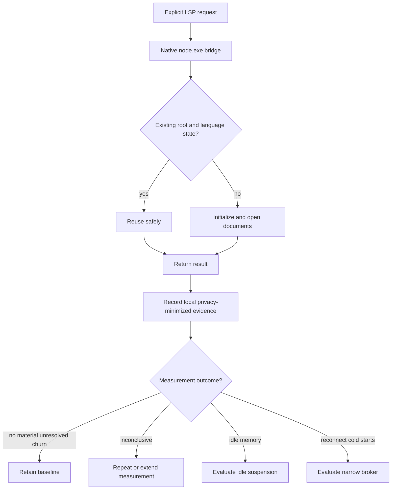
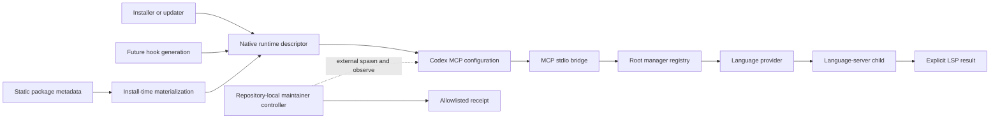
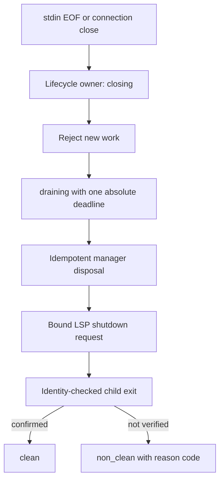

# LSP Bridge Process Reuse and Lifecycle Baseline - Plan

This document records the design debate, the evidence used to resolve it, and the resulting implementation-ready plan for reducing LSP bridge churn without creating a new always-on service. The Product Contract remains authoritative; the planning sections below add implementation units, verification contracts, sequencing, and explicit deferred boundaries without changing its meaning.

## Goal Capsule

- **Objective:** Restore reliable explicit LSP bridge behavior while reducing avoidable machine load and preserving seamless Codex use.
- **Product authority:** Codex users invoke LSP capabilities without selecting, attaching to, or managing processes.
- **Chosen direction:** Staged A-plus/C-first hybrid: use the reliable native Node runtime, keep automatic diagnostics disabled during measurement, preserve safe in-process reuse, batch any future hook invocation, and measure before adding idle suspension or a broker.
- **Open blockers:** The representative observation window, materiality thresholds, and local diagnostic-artifact retention rules must be settled before baseline results can authorize deeper lifecycle work. Launcher repair and explicit-capability validation are not blocked by those measurement decisions.

## Context and Motion

The original question was whether the LSP bridge should reuse one process instead of repeatedly launching Node processes, and whether unused processes should be stopped automatically. The broader machine investigation found that the current large `node_repl.exe` population belongs to Codex's internal Code Mode host, not to the LSP bridge. The LSP bridge currently has no active language-server process population to optimize in the observed snapshot.

The motion debated was:

> Choose the safest high-impact design for reducing Codex/LSP process churn and idle load while preserving seamless LSP capability and a reversible path to deeper reuse.

The decision criterion was measured machine-load reduction per unit of lifecycle risk. The debate treated the internal Code Mode host as a separate workstream and did not attribute its processes to the bridge.

## Debate Record

### Fact sheet

- The bridge keeps one manager per resolved workspace root in `src/index.ts` and one provider per language in `src/core/lsp-manager.ts` during one live bridge process.
- The bridge starts a language-server child lazily and intentionally shuts it down when the bridge is disposed.
- The PostToolUse hook can collect up to five files and launch a fresh bridge CLI once per file.
- The PostToolUse hook is currently disabled in the user's Codex configuration.
- The live bridge configuration points to a missing versioned Node executable.
- Bare `node` currently resolves first to `Documents\Codex\bin\node.cmd`; the reliable native runtime is `C:\Users\JackKenter(Intern)\AppData\Local\Programs\node-portable\node.exe`.
- `node_repl.exe` is a specialized Codex runtime with `NODE_REPL_*` variables, browser services, and native-pipe settings. It is not the bridge's documented standard Node launcher.
- The process snapshot found no active bridge or language-server processes and 39 `node_repl.exe` processes tied to the separate internal Code Mode host.
- MCP stdio uses a client-launched server subprocess. MCP lifecycle separates initialization, operation, and shutdown and recommends bounded request timeouts.

### Proposals considered

| Proposal | Core idea | Main benefit | Main cost or risk |
|---|---|---|---|
| A — In-process reuse first | Repair the launcher, batch the hook, harden lifecycle/concurrency, and add guarded idle suspension if measurements justify it. | High-confidence improvement without a new persistent service. | It cannot reuse state across short-lived MCP connections. |
| B — Persistent broker | Add a per-user or per-workspace broker that survives MCP connections and isolates root, language, and client state. | Only option that can amortize cold starts across MCP connections. | IPC, security, recovery, stale-state, shutdown, and persistent idle-process complexity. |
| C — Fast-mode simplification | Keep automatic diagnostics off, retain explicit MCP diagnostics, and defer lifecycle expansion. | Lowest operational risk and cleanest Zoom-time posture. | It does not address future hook amplification and may reduce automatic feedback. |
| A-plus/C-first hybrid | Repair the explicit path, keep automatic diagnostics off while measuring, preserve current reuse, require batching before hook reactivation, and gate all deeper reuse on evidence. | Best balance of reversibility, seamless use, and provable next decisions. | Immediate whole-machine improvement may be limited because current bridge load is unproven. |

### Cast and roles

- **Technologist:** advocated A and tested process boundaries, state isolation, lifecycle correctness, and the smallest buildable change.
- **Operator:** advocated C and tested Zoom-time stability, user-facing smoothness, cold-start friction, and operational simplicity.
- **Contrarian:** advocated B and tested whether cross-connection reuse was the only path to material savings.
- **Chair:** opened for the staged A-plus position and required evidence before a broker.
- **Final arbiter:** `sol-med`, as requested. The arbiter selected the staged A-plus/C-first hybrid.

### Round 1 — independent openings

#### Technologist opening — A

The strongest case for B is that MCP stdio is client-launched: if Codex repeatedly creates and disposes MCP connections, the existing bridge cannot share warm language-server children across those boundaries. The strongest case for C is that the PostToolUse hook can launch up to five fresh bridge CLI processes for one tool event, while explicit diagnostics preserve an escape hatch. **Conceded:** both points justify measuring connection churn and hook value before committing to deeper lifecycle work.

A addresses verified bridge defects with the smallest irreversible surface. The missing versioned Node executable is prerequisite launch hygiene, and the one-CLI-per-file hook design can create up to five bridge launches per event if re-enabled. Batching those files into one invocation removes avoidable process creation while preserving invisible Codex routing. The existing root and language boundaries should remain, with serialized initialization, document-update protection, stale-result rejection, and restart recovery that reopens documents before returning results.

The proposed A-plus sequence is repair, batch, instrument launches, connection duration, child lifetimes, latency, CPU, and memory, and only then consider persistent reuse. The strongest argument against A is that short-lived MCP connections could make a broker necessary. **Conceded:** that is a legitimate reversal condition, not a reason to pay broker complexity before measuring it.

#### Operator opening — C

The strongest case for A is that it directly attacks the bridge's apparent inefficiencies: repair the missing launcher, batch diagnostics, and reuse one MCP process so up to five changed files do not each launch a fresh bridge CLI. **Conceded:** if representative traces show active bridge churn, A likely offers more upside than C.

The current evidence does not establish that bridge churn drives Zoom-time load. The hook is already disabled, and the snapshot found zero active bridge or language-server processes. The observed 39 `node_repl.exe` processes belong to the separate internal Code Mode host. C therefore provides the cleanest operational envelope: keep automatic diagnostics off, preserve explicit MCP diagnostics, and investigate the actual Code Mode population separately.

The strongest argument against C is that the hook is already disabled, so C's incremental load reduction is currently zero; a repaired launcher and in-process reuse could reduce future cold starts. **Conceded:** C is risk control and measurement, not the maximum-upside architecture. Its position is to simplify the active path now and authorize deeper lifecycle reuse only after evidence.

#### Contrarian opening — B

A fixes the visible defects with limited lifecycle risk, and batching is the right first diagnostic baseline. **Conceded:** that changes the implementation sequence and should precede a broker.

However, A only reuses processes while one MCP process remains alive. MCP stdio is client-launched, and disposal shuts down the bridge and language-server children. If Codex reconnects frequently, each connection pays the fixed startup cost again. B is the only candidate that can amortize that cost across connections while keeping process selection invisible.

The broker should be narrow: isolate root, language, and logical-client state; use leases; do not suspend active work; and reinitialize and reopen documents after restart. The strongest argument against B is that reconnect frequency and cold-start cost are unmeasured, while a broker adds IPC, recovery, security, shutdown, and stale-state risk. **Conceded:** B is a higher-risk hypothesis until those measurements exist. The proposed B-lite path is to retain only proven-warm clients after telemetry justifies them.

### Chair response and Round 2 opening position

The chair opened for staged A-plus: repair the standard native Node launcher, keep automatic diagnostics off unless explicitly reconsidered, batch any future hook run into one invocation, add lifecycle and concurrency safeguards, and measure real bridge churn. Lease-aware idle suspension should be considered only if measurements show material idle LSP memory or repeated starts. A persistent broker should wait until reconnect frequency and cold-start cost prove in-process reuse insufficient.

The chair **conceded** that batching and launcher repair are concrete bridge improvements, **conceded** that current process evidence does not prove bridge load, and **conceded** that a broker is uniquely capable of cross-connection reuse. Those concessions made the final round about evidence gates rather than architectural preference.

### Final round — attacks and concessions

#### Technologist final position

The cross-connection ceiling of B is real, and the evidence that current load is unrelated to the bridge is also real. **Conceded:** both points change the measurement design. The chair's “measure” needs defined metrics and gates or it risks becoming maintenance theater. Keeping diagnostics off may also reduce seamlessness if users must remember to invoke them.

The Technologist held A with a sharper spine: repair the native launcher, batch changed files, instrument bridge launches, connection duration, child lifetimes, request latency, CPU, and memory, then harden concurrency and restart semantics. Automatic diagnostics should remain off during measurement and be reconsidered based on observed responsiveness and load. Idle suspension belongs only after proof that resident LSP memory is material. The reversal to B is frequent MCP reconnects plus costly cold starts that persist after these A-plus changes.

#### Operator final position

The chair's case is stronger than pure C because it repairs the explicit path without prematurely creating a service. **Conceded:** that is materially better than leaving a broken launcher in place. Repairing the launcher is compatibility hygiene, batching has no immediate savings while the hook is disabled, and lifecycle work before proof could optimize an inactive path.

The Operator switched to a C-first hybrid: keep automatic diagnostics off, repair only the launcher required for explicit diagnostics, retain explicit tools, batch any future hook reactivation, and defer suspension, broader lifecycle changes, and B until telemetry establishes material bridge cost. The reversal to A-plus is recurring bridge launches or costly cold starts; the reversal to B requires that cost to persist across MCP reconnects after A-plus reuse.

#### Contrarian final position

The chair's staged approach is disciplined, and current evidence does not prove that the bridge drives Zoom-time load. **Conceded:** this lowers B's immediate expected payoff. A-plus cannot amortize short-lived MCP connections, while C adds little incremental reduction because the hook is already off.

The Contrarian held a B-spine hybrid: execute low-risk A fixes and measurement first, but design toward a narrow per-user or per-workspace broker keyed by root, language, and logical client. Retain only proven-warm clients and add no speculative pool or idle suspension until traces establish demand. The reversal to A-plus is no material cross-connection churn or cold-start cost.

### Arbiter scorecard and verdict

| Option | Measured-load basis | Lifecycle risk | Seamless behavior | Reversibility | Result |
|---|---|---:|---:|---:|---|
| Full A | Strong only if automatic diagnostics or bridge churn returns | Medium | High | High | Too broad before measurement |
| C-only | Matches current evidence and minimizes risk | Low | High | Very high | Safe but incomplete |
| Persistent B broker | Useful only if reconnect churn and cold starts are material | High | Medium-low | Medium | Not evidence-supported |
| Staged A-plus/C-first | Repairs the explicit path, preserves automatic-diagnostics-off, measures real churn, and gates batching before reactivation | Low | High | Very high | **Winner** |

**Verdict:** Adopt the staged A-plus/C-first hybrid. Use the reliable native `node.exe` directly, keep automatic diagnostics disabled during the baseline, preserve safe in-process reuse, add bridge-specific observability, and require one batched invocation before any hook reactivation. Do not implement idle suspension or a persistent broker in the active scope.

**Reversal condition:** Evaluate conditional idle suspension if measurements show material idle LSP memory inside long-lived MCP connections. Evaluate a narrow broker only if representative traces show frequent MCP reconnections, materially costly repeated cold starts, and unresolved cost after the baseline. The broker must preserve root, language, and logical-client isolation, deterministic recovery, clean shutdown, and transparent Codex behavior.

## Product Contract

### Summary

The selected scope is a staged A-plus/C-first hybrid. It repairs the broken native launcher, preserves the automatic-diagnostics-off posture, validates existing in-process reuse and lifecycle behavior, and introduces bridge-specific measurement through an opt-in local diagnostic harness. R5–R13 are verification invariants, not blanket new implementation requirements; remediate only confirmed correctness, isolation, or shutdown defects. The scope does not create a persistent broker, idle-suspension mechanism, resident diagnostic service, or shared persistent state.

### Problem Frame

The bridge configuration references a missing versioned Node executable, while bare `node` resolves first to a command shim. The reliable launcher is the native portable Node executable supplied for this machine. `node_repl.exe` is a specialized Code Mode runtime and is not a suitable substitute for the bridge.

Within a live MCP process, the bridge already reuses one manager per workspace root and one provider per language. MCP stdio connections are client-launched and dispose the bridge and its language-server children when the connection ends. The disabled PostToolUse hook could create up to five fresh bridge CLI processes per edit event if re-enabled unchanged.

The observed `node_repl.exe` processes belong to Codex internal Code Mode and are outside this work. Current evidence does not establish active bridge load, so a persistent broker or idle timer would be an unproven optimization with meaningful lifecycle risk.

### Key Decisions

- **Staged A-plus/C-first baseline:** Repair explicit-tool reliability and collect evidence before adding lifecycle complexity. Governs R1–R21.
- **Stage boundary:** Active baseline changes are R1–R4, R14–R17, R19, and R21. R5–R13 are invariants to verify against existing behavior; remediate only failures that break explicit LSP correctness, isolation, or clean shutdown. R18 and R20 are future expansion gates, not current implementation requirements.
- **Native standard Node only:** Use the reliable portable `node.exe` directly for the bridge runtime; do not use the `.cmd` shim or `node_repl.exe` as that runtime. Governs R1–R4.
- **Automatic diagnostics remain off during baseline:** Preserve explicit LSP access without reactivating the hook. Governs R3, R17, and R19.
- **In-process reuse remains the current boundary:** Verify the existing root-scoped managers and language-scoped providers within a live MCP process; do not broaden this into new cross-connection persistence. Governs R5–R7.
- **Measurement is bounded and opt-in:** Collect baseline data only through a local harness that is inactive outside measurement runs and creates no resident service or persistent shared state. Governs R15, R16, and R19.
- **Batch before reactivation:** Any future automatic diagnostic proposal must reduce one edit event to at most one bridge CLI invocation. Governs R18.
- **Evidence before expansion:** Idle suspension and cross-connection brokering require a separate evidence-backed decision. Governs R20 and R21.
- **Separate Code Mode attribution:** Do not attribute internal `node_repl.exe` load to the LSP bridge. Governs R14–R16.

### Requirements

#### Launcher and explicit capability

- R1. Every bridge launch, including commands generated by the installer, updater, or hook configuration, must invoke the configured native `node.exe` directly.
- R2. The bridge's own runtime launch must not invoke `node.cmd`, another command shim, or `node_repl.exe`. This restriction does not prohibit a configured language-server executable from using a supported `.cmd` or `.bat` launcher when that language server requires it.
- R3. Explicit Codex LSP requests must work while automatic PostToolUse diagnostics remain disabled.
- R4. The Codex launcher or configuration-validation path must surface a clear, actionable failure when the configured native launcher is missing, stale, or not executable.

#### Reuse, isolation, and lifecycle

- R5. Within one live MCP process, repeated requests for the same workspace root must reuse one manager.
- R6. Within one manager, repeated requests for the same language must reuse one provider unless recovery requires replacement.
- R7. Managers, providers, documents, diagnostics, and other mutable state must not leak between workspace roots or language providers within one live MCP process.
- R8. Users must not select, attach to, or manage bridge or language-server processes.
- R9. The bridge must not suspend or terminate a required manager or provider while requests or document work remain active.
- R10. MCP connection shutdown must stop accepting new work, dispose the bridge's managers, providers, and language-server children, and confirm within a bounded timeout that no bridge-owned orphan processes remain.
- R11. After provider restart within a live connection, or after a fresh bridge start, the service must initialize and open the documents required for the current request before returning a dependent result.
- R12. Concurrent first requests for the same root and language must not create duplicate steady-state managers, providers, or language-server children.
- R13. Launcher, initialization, recovery, and document-reopen failures must return actionable errors rather than stale or partial success.

#### Measurement and reversible expansion

- R14. Measurement must distinguish bridge and language-server processes from Codex internal Code Mode processes using both a negative control (Code Mode activity without bridge activity) and a positive control (bridge activity while Code Mode activity is also present). If process ownership cannot be established, attribution is inconclusive and cannot support a load or improvement claim.
- R15. Baseline evidence must be collected through an opt-in local diagnostic harness that is inactive outside measurement runs, creates no resident service or persistent shared state, and covers bridge launches, MCP connection duration, child lifetime, initialization or cold-start latency, request latency, CPU use, memory use, restarts, and recovery failures.
- R16. Measurement data must not capture source contents, document text, credentials, or unrelated process data.
- R17. PostToolUse automatic diagnostics must remain disabled throughout the baseline period.
- R18. Any proposal to reactivate automatic diagnostics must guarantee at most one bridge CLI invocation per edit event, regardless of the number of checks requested.
- R19. Launcher, measurement-harness, and hook-state changes must be independently reversible without changing workspace data or requiring persistent-state migration.
- R20. Idle suspension or broker work must not enter active implementation scope until representative measurements establish a material unresolved cost.
- R21. Baseline measurement must conclude with one of four outcomes: retain the baseline, repeat or extend measurement because evidence is inconclusive, evaluate conditional idle suspension, or evaluate a narrow broker.

### Actors

- A1. **Codex user:** Invokes LSP capabilities without managing processes.
- A2. **Codex MCP client:** Starts and closes the stdio bridge connection.
- A3. **LSP bridge:** Routes requests and owns root-scoped managers.
- A4. **Workspace manager:** Isolates state for one workspace root.
- A5. **Language provider:** Owns one language-server lifecycle within its manager.
- A6. **Language server:** Supplies semantic language capabilities.
- A7. **PostToolUse hook:** Currently disabled source of potential automatic diagnostic invocations.
- A8. **Maintainer:** Reviews local diagnostic evidence and approves lifecycle-scope expansion.

### Key Flows

- F1. **Explicit LSP request:** Codex requests an LSP operation; the MCP client uses native `node.exe`; the bridge selects the manager for the workspace root; the manager selects the provider for the language; the provider initializes and opens required documents before returning the result.
- F2. **In-connection reuse:** A later request for an existing root and language reuses the manager and provider without creating a duplicate steady-state language server.
- F3. **Provider recovery:** After an unexpected provider or language-server exit, the next dependent request reinitializes the service and reopens required documents before returning a result.
- F4. **Connection shutdown:** When the MCP client closes the stdio connection, the bridge stops accepting new work, disposes managers and providers, and confirms within the bounded shutdown timeout that no bridge-owned child process remains active.
- F5. **Baseline measurement:** Representative explicit LSP work runs with automatic diagnostics disabled; an opt-in local harness records bridge-specific lifecycle and resource measurements; internal Code Mode processes are excluded; the maintainer selects the outcome under R21. A separate hook benchmark may be run only as a future reactivation evaluation and does not require re-enabling the normal hook.
- F6. **Future automatic-diagnostics proposal:** A future proposal must demonstrate user benefit, batch all checks from one edit event, verify at most one bridge CLI launch per event, and receive an explicit scope decision before reactivation.

### Acceptance Examples

- AE1. **Native launch:** Given the bridge is invoked, process evidence identifies the portable native `node.exe` and no `.cmd` shim or `node_repl.exe` for the bridge's own runtime.
- AE1a. **Generated launch configuration:** Given the installer, updater, or hook configuration is generated or refreshed, the resulting bridge and hook launch commands invoke the approved native `node.exe` directly rather than a bare `node`, `.cmd` shim, or `node_repl.exe`.
- AE2. **Explicit operation:** Given automatic diagnostics are disabled, an explicit diagnostic request initializes the correct provider and returns a result.
- AE3. **Root reuse:** Given two requests for the same root and language in one connection, one manager and one steady-state provider serve both.
- AE4. **Root isolation:** Given requests for two workspace roots, each root receives distinct state and cannot observe the other root's documents.
- AE5. **Language isolation:** Given two languages in one root, each language receives its own provider.
- AE6. **Concurrency:** Given simultaneous first requests for the same root and language, the settled state contains one manager, one provider, and one steady-state language-server child.
- AE7. **Clean shutdown:** Given the MCP connection closes normally, no bridge-owned language-server child remains after the bounded shutdown timeout.
- AE8. **Recovery:** Given a language server exits, the next dependent request succeeds only after reinitialization and document reopening.
- AE9. **Recovery failure:** Given reinitialization fails, Codex receives an actionable failure and no stale diagnostic result.
- AE10. **Attribution negative control:** Given active `node_repl.exe` processes but no bridge activity, diagnostic evidence reports zero bridge launches rather than attributing Code Mode load to the bridge.
- AE10a. **Attribution positive control:** Given a controlled bridge workload with bridge-owned process(es) and active `node_repl.exe` processes at the same time, diagnostic evidence identifies bridge launches and bridge-owned children separately from Code Mode processes. If it cannot establish that ownership, the run is marked **INCONCLUSIVE** and cannot be used to claim bridge load or improvement.
- AE11. **Hook batching (future reactivation gate):** Given one edit event requests five diagnostic checks, a future enabled hook launches no more than one bridge CLI.
- AE12. **Reversal:** Given either the native-launcher configuration or the opt-in measurement harness is rolled back, workspace files and persistent user state require no migration or repair, and automatic diagnostics remain disabled.
- AE13. **Measurement sufficiency:** Given the representative workload and both attribution controls are complete, the run records one of the four R21 outcomes. If the workload or attribution evidence is insufficient, the run is marked **INCONCLUSIVE** and cannot support a bridge-load or improvement claim.
- AE14. **Measurement privacy:** Given a baseline run, local artifacts contain only allowlisted process and lifecycle metrics and contain no source contents, document text, credentials, or unrelated process data.

### Success Criteria

- Explicit LSP operations use the native standard Node executable and require no user process management.
- Automatic diagnostics remain disabled during baseline measurement.
- Manager and provider reuse satisfies root and language ownership invariants.
- Connection shutdown leaves no bridge-owned orphan process within the bounded shutdown timeout.
- Restart recovery reinitializes the provider and reopens required documents before returning dependent results.
- Measurements distinguish bridge activity from internal Code Mode activity through both negative and positive attribution controls; an ownership failure is explicitly **INCONCLUSIVE** rather than a passing or failing load result.
- No bridge-load or machine-load improvement claim is made unless the workload is representative and attribution controls pass.
- Evidence supports a documented retain, idle-suspension evaluation, or broker-evaluation decision, or explicitly records **INCONCLUSIVE** and a bounded repeat or extension of measurement.
- No broker or idle-suspension commitment is made without satisfying R20.

### Scope Boundaries

#### In scope

- Native launcher correctness.
- Explicit LSP behavior.
- Existing in-process reuse.
- Root and language isolation.
- Shutdown, concurrency, and restart requirements.
- Opt-in local diagnostic harness for bridge-specific lifecycle and resource measurement.
- A batching requirement for any future hook proposal.
- Reversibility of the baseline.

#### Deferred for later

- Conditional idle suspension.
- Persistent broker design or implementation.
- Cross-MCP-connection reuse.
- Automatic-diagnostics reactivation.

#### Outside this work's identity

- Internal Code Mode host optimization.
- Management of unrelated `node_repl.exe` processes.
- User process selection.
- Persistent mutable state shared across clients.
- Changes to workspace content or project processes.

### Dependencies / Assumptions

- The portable native Node executable is resolved from an approved native path; this machine currently uses the identified portable `node.exe` path, which must not be assumed for unrelated installations.
- The Codex MCP client continues to own stdio server startup and connection shutdown.
- Existing manager-per-root and provider-per-language reuse behavior is retained.
- Representative explicit LSP usage can be observed without enabling the PostToolUse hook.
- Bridge-owned processes can be identified separately from Codex internal processes.
- Installer, updater, and hook configuration paths can be changed or validated so they do not reintroduce a bare `node` or command-shim bridge launcher.
- Materiality thresholds and the representative observation window will be approved before interpreting measurement data.

### Outstanding Questions and Planning Inputs

#### Maintainer inputs before baseline interpretation

- What observation window and usage sample constitute representative Codex work?
- What latency, launch-frequency, CPU, or memory thresholds make cold-start cost material?
- Where should privacy-minimized local diagnostic artifacts be retained, and for how long?

#### Resolved defaults and future-expansion boundary

- An in-flight operation that observes child exit returns an actionable server_exited or unavailable result; the next dependent operation may share one generation-scoped recovery and document-reopen attempt.
- Shutdown uses the 1,000 ms request, 1,500 ms child-grace, and 3,000 ms shared aggregate defaults; observed exit is clean, and uncertain ownership or cleanup is non_clean with a reason code.
- Future PostToolUse reactivation requires an explicit maintainer/release approval record and remains outside this implementation.
- If a broker evaluation becomes justified, its future boundary is logical client plus canonical root plus language, with no shared state until a separate product decision.

### Sources / Research

- `src/index.ts` and `src/core/lsp-manager.ts`: existing manager-per-root and provider-per-language reuse.
- `src/core/json-rpc-lsp-client.ts`: lazy child start and shutdown behavior.
- `src/transport/mcp.ts` and `src/index.ts`: serial stdio dispatch, EOF ownership, and manager disposal boundary.
- `src/core/doctor.ts`: current hook/config readiness semantics and the need to separate explicit MCP readiness from hook state.
- `src/core/workspace-root.ts` and `src/utils/uri.ts`: lexical/canonical root and URI boundary behavior.
- `scripts/codex-lsp-post-tool-use.mjs`: per-file bridge CLI launch behavior.
- `scripts/codex-lsp-post-tool-use-core.mjs`, `src/transport/ipc.ts`, and `tests/ipc.test.ts`: deferred IPC/cache artifacts and the inactive-boundary test disposition.
- `package.json`, `tsconfig.build.json`, `scripts/verify-package.mjs`, and `scripts/smoke-package.mjs`: compiled-artifact and post-build package verification constraints.
- `README.md`: documented standard Node launcher for the bridge MCP server.
- User `.codex/config.toml`: disabled hook state, missing versioned bridge runtime, and specialized `node_repl.exe` configuration.
- Local process observations from 2026-08-18: zero active bridge or language-server processes and 39 `node_repl.exe` processes associated with internal Code Mode.
- [MCP transports](https://modelcontextprotocol.io/specification/2025-06-18/basic/transports): stdio is a client-launched server subprocess; Streamable HTTP is the multi-client transport.
- [MCP lifecycle](https://modelcontextprotocol.io/specification/2025-06-18/basic/lifecycle): initialization, operation, shutdown, and bounded request timeouts.
- [MCP transports, 2026-07-28](https://modelcontextprotocol.io/specification/2026-07-28/basic/transports): stdin closure, bounded stream behavior, and unexpected subprocess termination.
- [MCP lifecycle, 2026-07-28](https://modelcontextprotocol.io/specification/2026-07-28/basic/lifecycle): lifecycle ownership and shutdown expectations.
- [Node child_process](https://nodejs.org/api/child_process.html): child lifecycle, exit observation, and kill semantics.
- [Windows CreateProcess](https://learn.microsoft.com/en-us/windows/win32/api/processthreadsapi/nf-processthreadsapi-createprocessw): Windows process creation and ownership boundary considerations.
- [npm folders](https://docs.npmjs.com/cli/v11/configuring-npm/folders) and [npm cmd-shim](https://github.com/npm/cmd-shim): package entrypoint and Windows shim behavior.
- Debate record above: independent openings, chair response, final positions, concessions, and arbiter verdict.

## Planning Contract

### Product Contract preservation

The Product Contract is unchanged. This enrichment preserves the meaning and stable identifiers of R1-R21, A1-A8, F1-F6, and AE1-AE14. It adds implementation detail only; it does not activate the deferred broker, idle-suspension, cross-connection, or automatic-hook scope. The Debate Record remains part of this artifact as the product decision record.

### Plan depth and execution profile

- **Depth:** Deep. The work crosses launcher generation, runtime validation, MCP stdio lifecycle, LSP child ownership, measurement privacy, packaging, and Windows process behavior.
- **Execution profile:** Code. The plan is implementation-ready, but this ce-plan run does not modify source code, tests, package metadata, or runtime configuration.
- **Primary sequencing rule:** Repair and validate launcher behavior and the explicit no-hook MCP baseline before interpreting measurements. Characterize existing lifecycle behavior before changing it.
- **Stop conditions:** Do not add a broker, idle timer, resident service, cross-connection state, process-selection capability, or automatic-hook reactivation under this plan.
- **Compatibility rule:** Preserve the existing MCP tool names, argument shapes, read-only behavior, diagnostic truth fields, and legacy protocol compatibility boundary unless a separate contract decision approves a change.

### Key technical decisions

- **KTD1 - One compiled native launch descriptor:** Define the canonical descriptor and validator in src/core/native-node-runtime.ts and consume its compiled dist/core/native-node-runtime.js artifact from packaged .mjs scripts. Keep generated launch-record validation separate from validation of the currently running Node identity. The descriptor resolves an absolute trusted native node.exe, rejects command shims and node_repl.exe, revalidates immediately before spawn, and returns stable actionable failure codes.
- **KTD2 - Install-time materialization:** Static package metadata is a template-only surface because it cannot safely embed a machine-specific executable path. Installer-generated Codex configuration is the authoritative active launch record. Static plugin activation must either materialize that record first or report that installation is incomplete; it must not silently bypass the descriptor. Auto-update resolves or installs the package during an explicit update operation, then writes an immutable local bridge entrypoint; MCP startup never runs mutable npm exec, npx, latest, or network resolution.
- **KTD3 - In-process boundary and canonical identity:** Retain manager-per-root and provider-per-language state only within one live MCP process. Canonicalize existing roots consistently across manager keys, providers, URI checks, and document state: realpath existing roots, normalize Windows separators and case, reject outside-root reparse targets, and use a normalized lexical identity only for roots that do not yet exist. Single-flight initialization and recovery are required invariants for R11/R12, not optional changes gated on characterization. Do not introduce a broker or shared state across MCP connections.
- **KTD4 - One lifecycle owner and explicit states:** The transport lifecycle coordinator owns connection state and invokes idempotent manager disposal exactly once. Use open, closing, draining, clean, and non_clean states. When closing begins, reject new work, track active requests, propagate one absolute disposal deadline, bound the LSP shutdown request and child-exit confirmation, and report a reasoned non-clean result if ownership or exit cannot be verified.
- **KTD5 - Generation-scoped recovery:** Model provider state as ready, exited, recovering, ready, or failed by child generation. Retain a reopen manifest for required documents, create one recovery promise per exit generation, let follower requests share that recovery, and never automatically retry the failed request. Recovery failure is actionable and never returns stale or partial success.
- **KTD6 - Repository-local maintainer measurement:** Add a separate opt-in lifecycle harness kept in the repository and excluded from the published package. It externally launches the same materialized bridge record used by explicit Codex operation, observes only bridge-owned evidence, and remains outside the MCP tool surface, normal startup, and persistent state.
- **KTD7 - Explicit attribution and receipt gate:** A schema-validated receipt must distinguish bridge-owned processes from Code Mode activity using a negative control and a simultaneous positive control. Missing workload, missing ownership evidence, incomplete controls, cleanup uncertainty, or missing required metrics produces INCONCLUSIVE and cannot support a load claim; startup or execution failure produces HARNESS_ERROR with no completed receipt.
- **KTD8 - Baseline hook state is absent or disabled:** The default installer must not add or enable the managed PostToolUse hook. It may preserve and report an existing user-owned state, but it must not silently change it. The active per-file wrapper and separate batching/IPC helper remain future-only and are tested as different implementations. Any future gate must count total bridge CLI launches across mixed-language edits.
- **KTD9 - MCP action and context parity:** Preserve the existing read-only MCP tool catalog, schemas, annotations, structured result fields, workspace-root resolution, language configuration, and source-revision semantics. lsp_status remains readiness-only and never exposes PIDs, telemetry, receipts, or process controls. New connections receive fresh ephemeral state and must reissue work; no checkpoint, broker, or resume surface is added.
- **KTD10 - Trusted boundaries and safe failure:** Generated configuration writes are atomic and reparse-safe, structured arguments reject control characters and unsafe syntax, root containment is canonical and revalidated, and process termination requires handle-backed or identity-checked ownership. Stable bounded error codes distinguish missing, untrusted, unavailable, non-clean, inconclusive, and harness-error outcomes without returning raw paths, arguments, environment values, or child output.

### High-level technical design

The descriptor is the only place that decides whether a runtime executable is acceptable. The compiled descriptor artifact is the shared boundary for TypeScript runtime code and packaged .mjs scripts. Static metadata is a template-only surface; activation requires install-time materialization. The bridge itself remains an MCP stdio server with the existing read-only tool catalog. The repository-local measurement controller externally launches the same materialized record used by explicit operation and has no production-runtime or MCP-facing dependency.

The lifecycle owner must provide a single absolute deadline to manager, provider, and client disposal. A language-server wrapper is cleanly terminable only when the Windows ownership adapter proves the wrapper and descendants belong to this bridge instance. PID, parent PID, image name, or path alone is insufficient; uncertain or detached descendants produce non_clean rather than a broad tree kill.

### System-wide impact

| Area | Planned effect | Explicit non-effect |
|---|---|---|
| Bridge runtime | Validate its own native Node launch and harden root, provider, recovery, and shutdown boundaries. | No user process selection, attachment, or management. |
| MCP transport and tools | Add one lifecycle owner around stdio EOF, preserve the exact read-only tool catalog and structured result truth fields, and fail closed on cross-root access. | No new tool, argument, protocol, process-control, telemetry, receipt-retrieval, checkpoint, or resume surface. |
| Installer and updater | Materialize trusted native runtime paths, use an immutable local package entrypoint, write managed files atomically, and reject shim-based bridge launches. | No network/package resolution on MCP startup, persistent service installation, workspace migration, or broad rollback deletion. |
| Package metadata | Preserve platform-neutral templates while requiring install-time materialization before activation and verifying the static/template boundary. | No machine-specific path committed to a cross-platform package manifest and no direct package-bin bypass of the descriptor. |
| PostToolUse | Leave the managed hook absent or disabled by default, preserve existing user-owned state, and document future batching as a gate. | No silent hook activation, batching implementation, or claim that the helper satisfies the shipped path. |
| Measurement | Add an opt-in repository-local controller that externally launches the materialized bridge and emits one allowlisted receipt. | No published measurement utility, source text, credentials, raw child output, unrelated process telemetry, resident collector, or MCP exposure. |
| Documentation | Align launcher, lifecycle, measurement, and release guidance with the implemented contract. | No claim that synthetic fixtures are production acceptance. |

### Planning inputs before baseline interpretation

The representative observation window, materiality thresholds, and artifact-retention decision remain maintainer inputs to the measurement phase rather than hidden implementation assumptions. The harness must therefore:

- record sample counts, workload identity at the level of operation class, and control completion;
- emit raw lifecycle/resource evidence without deciding that a threshold is material;
- emit one schema-validated receipt to stdout; any run-scoped temporary files are deleted on every completed path;
- never require a resident directory, database, cache, IPC endpoint, or shared state;
- require explicit maintainer opt-in to retain an artifact in a protected destination;
- use a random per-run salt for root fingerprints and never reuse the deferred deterministic IPC/cache hash;
- produce INCONCLUSIVE when the workload, controls, ownership, cleanup, or required metrics are incomplete, and HARNESS_ERROR when the harness cannot produce a completed receipt.

### Sequencing and dependencies

1. **S0 - Characterize and inventory:** Define the absent/disabled-hook baseline, MCP tool/catalog parity, current root identity, process-ownership capability, and historical IPC/cache boundary. Convert the broken IPC test into a runnable inactive-boundary fixture before treating ci:verify as a valid contract.
2. **S1 - Repair the explicit launch boundary:** Implement and validate the compiled descriptor artifact, launch-surface matrix, atomic generated configuration, doctor status, default no-hook installation behavior, and post-build fresh-process replay. Do not begin baseline measurement until the generated configuration launches the intended trusted native runtime.
3. **S2 - Harden confirmed lifecycle defects:** Exercise the transport lifecycle with tracked dispatch, fake or controlled language-server failures, and post-build smoke coverage. Fix confirmed defects in reuse, initialization serialization, document reopening, shutdown, process ownership, or result truthfulness.
4. **S3 - Run the bounded measurement path:** Implement the repository-local external harness, redaction and attribution controls, schemaed receipt, cleanup, and INCONCLUSIVE/HARNESS_ERROR distinction. Keep the normal hook absent or disabled.
5. **S4 - Package and hand off:** Update package verification to exclude the harness, smoke tests, docs, release notes, atomic rollback guidance, and future-only hook/IPC boundaries. Record what evidence would authorize R20/R21 expansion.

Dependencies are the approved native Node source, the current MCP stdio ownership model, the existing workspace-root and language-detection contracts, Windows process inspection/termination behavior, and maintainer approval of the observation window and interpretation thresholds.

### Risks and mitigations

| Risk | Mitigation |
|---|---|
| A generated surface silently falls back to node, npm, or a shim. | Test every launch surface through one descriptor contract and replay a fresh installed process. |
| A language-server .cmd/.bat wrapper leaves descendants alive. | Track the known wrapper PID, use a platform-specific owned-tree termination adapter, verify exit, and surface non-clean status. |
| Shutdown changes deadlock active requests or hide failures. | Use explicit closing state, separate deadlines, injected unresponsive-server fixtures, and no false clean result. |
| Recovery returns old diagnostics after a server exit. | Invalidate state on exit, serialize one recovery, reopen documents, and test source revisions and stale-result rejection. |
| Code Mode load is attributed to the bridge. | Use negative and positive controls, bridge-owned lineage only, and INCONCLUSIVE on ownership failure. |
| The measurement harness becomes a hidden service. | Keep it CLI-only, opt-in, run-scoped, stdout-first, and absent from normal MCP tools and package startup. |
| Historical IPC/cache code is reactivated accidentally. | Mark it deferred-only, audit imports and generated hook paths, and do not add broker behavior or persistent state. |
| Synthetic tests pass while Windows behavior fails. | Require manual native-Windows process and fresh-install evidence before claiming acceptance. |

## Implementation Units

### U1. Native bridge launch descriptor and generated configuration

**Objective:** Make every active bridge launch path resolve and invoke a validated native node.exe while preserving the language-server .cmd/.bat exception.

**Requirements and decisions:** Covers R1-R4 and R19. The canonical source module is src/core/native-node-runtime.ts and the packaged scripts consume only its compiled dist/core/native-node-runtime.js artifact after build validation. The module exposes separate checks for a generated launch record and the current process identity. The descriptor accepts only an absolute trusted native executable whose final path and file identity are revalidated immediately before spawn; it rejects command shims, node_repl.exe, unsafe reparse/UNC/device paths, control characters, and mutable package commands. process.execPath may be used only after identity validation and must not be persisted blindly.

The baseline installer does not add or enable the managed PostToolUse hook. It preserves existing user-owned hook state and reports it, but an enabled existing hook requires explicit user action before measurement. The default and update operations materialize an immutable local package entrypoint and write a native-node command record. Package-manager work occurs only during an explicit install/update operation; MCP startup never runs npm exec, npx, latest, or network resolution. The installer process itself may be invoked by a package-manager wrapper, but the bridge command it emits is always inside the native-launch guarantee. Language-server launch resolution remains separate; a .cmd or .bat language-server command is accepted only under its explicit trust and process-ownership policy.

**Files and surfaces:**

- Add the canonical runtime descriptor and validator in src/core/native-node-runtime.ts.
- Package dist/core/native-node-runtime.js and have scripts/install-codex.mjs and scripts/codex-lsp-post-tool-use.mjs consume that compiled artifact only after ensureBuilt validation.
- Integrate current-process and launch-record validation into src/index.ts and src/core/doctor.ts so runtime and doctor report stable launcher codes without raw paths or child output.
- Update scripts/install-codex.mjs to materialize the default no-hook state, preserve user-owned records, serialize structured TOML/JSON arguments, reject unsafe package/path values, and rollback managed files atomically on partial failure.
- Treat .mcp.json, .codex-plugin/plugin.json, and hooks/hooks.json as template-only surfaces. Package activation must materialize the native record before use; package checks must prove that static package-bin commands cannot bypass it.
- Update scripts/smoke-install.mjs, scripts/smoke-package.mjs, scripts/verify-package.mjs, package.json, and package-contract expectations for the compiled descriptor, direct native entrypoint, auto-update, no-hook, and package-template boundary.
- Add tests/native-node-runtime.test.ts and extend tests/doctor.test.ts, tests/package-contract.test.ts, and the installer smoke fixtures.

**Verification scenarios:**

- Happy path: approved absolute native node.exe is accepted and appears in generated default and auto-update configuration.
- Edge cases: missing path, stale path, non-executable path, fake node.exe, validation-to-spawn replacement, node.cmd, npm.cmd, npx, node_repl.exe, relative path, unsafe reparse/UNC/device path, control characters, and path containing spaces produce distinct actionable failures.
- Compatibility: a language-server .cmd or .bat command remains accepted only at the language-server boundary and is wrapped safely.
- Configuration safety: malformed or duplicate TOML/JSON, symlinked CODEX_HOME, concurrent writes, user-edited managed blocks, malicious package specs, and partial-write failure preserve unrelated settings and report rollback_complete or rollback_partial.
- Hook baseline: a default temporary profile contains MCP configuration but no managed PostToolUse hook, and an existing disabled/enabled user-owned state is not silently changed.
- Static/template matrix: package manifests, generated config.toml, generated hooks.json, local package-bin invocation, and update mode each report whether they are authoritative, materialized, or template-only; no active path bypasses the descriptor.
- Fresh-process acceptance: post-build smoke against a temporary Codex profile starts the bridge with native node.exe and does not depend on the current shell's PATH.

**Dependencies:** S0 inventory; the existing build-before-install contract; the approved native runtime source; package inclusion of dist/core/native-node-runtime.js; U2's explicit MCP status contract.

**Exit evidence:** A launch-surface matrix is covered by tests and smoke output, the compiled descriptor is consumed by both TypeScript and packaged scripts, doctor distinguishes explicit MCP readiness from hook state and launcher failure, managed-file writes prove atomic rollback behavior, and a post-build fresh installed process replay confirms the generated command rather than only inspecting text.

### U2. Explicit MCP baseline, reuse, recovery, and bounded shutdown

**Objective:** Verify the existing in-process ownership boundary and repair only confirmed lifecycle defects so explicit LSP remains reliable when automatic diagnostics are absent.

**Requirements and decisions:** Covers R3 and R5-R13. Preserve the existing read-only MCP tool catalog, names, schemas, annotations, language-selection behavior, structured result fields, and legacy protocol compatibility. Do not invent a language argument for symbol-only operations. Add exact tool-registry/dispatch parity coverage, and keep lsp_status limited to readiness, installation, build, and language-server availability. It must never expose PIDs, process trees, CPU, memory, telemetry, receipts, or process controls.

Use one lifecycle coordinator in src/transport/mcp-lifecycle.ts. It owns open, closing, draining, clean, and non_clean states, tracks active dispatch promises, rejects new calls after EOF, and invokes manager disposal exactly once. The transport may dispatch parsed requests through tracked promises so EOF can be observed while a request is blocked; request IDs, not input ordering, determine responses. A completed request must be completed, failed, explicitly timed out, or explicitly marked incomplete; no detached work, job handle, checkpoint, or cross-connection resume exists.

Root identity is canonical and consistent: existing roots realpath before manager-key creation, normalize Windows separators and case, coalesce equivalent symlink aliases when they resolve to the same trusted root, and revalidate root containment after target discovery and before file access. Lexical identity is used only for non-existent roots. Marker discovery selects a root but does not authorize boundary expansion. Cross-root access and outside-root junction/reparse targets fail closed.

Serialize manager/provider initialization and document opening. Model provider state by child generation as ready, exited, recovering, ready, or failed. Retain a reopen manifest for documents needed by dependent operations. On unexpected language-server exit, fail the in-flight request with a stable server_exited or unavailable result, invalidate old state, and allow one recovery promise for that exit generation. Concurrent followers share the recovery result; the failed request is not automatically retried. Never return stale diagnostics or partial success.

MCP EOF and LSP shutdown are separate. Use one absolute disposal deadline propagated through transport, manager, provider, and client. The planning defaults are 1,000 ms for the shutdown request, 1,500 ms for child-exit grace, and 3,000 ms for aggregate disposal; the aggregate budget is shared rather than multiplied per provider. If the child remains alive, use the process-ownership adapter, verify creation identity and actual exit, and report a non_clean reason code. Clean means observed exit, not a sent kill signal. If EOF leaves no response channel, clean EOF exits successfully; cleanup failure writes a sanitized status to stderr and exits nonzero.

**Files and surfaces:**

- Update src/index.ts, src/transport/mcp.ts, src/core/lsp-manager.ts, src/core/lsp-semantic-provider.ts, src/core/json-rpc-lsp-client.ts, and src/core/workspace-root.ts.
- Add src/transport/mcp-lifecycle.ts and src/core/process-ownership.ts for the lifecycle coordinator and platform-specific owned-child boundary. The Windows adapter must prefer handle-backed or Job Object ownership; PID, parent PID, image name, or path alone cannot authorize termination. Detached/breakaway or uncertain descendants remain alive and produce non_clean; broad image-name or recursive tree killing is prohibited.
- Add tests/mcp-lifecycle.test.ts for injected transport dispatch, no-hook explicit MCP operation, tool-registry parity, root/language orchestration, reconnect reinitialization, EOF during a blocked request, and lifecycle state/reason codes. Reserve actual dist-process replay for scripts/smoke-package.mjs and native Windows acceptance because ci:verify tests run before build.
- Add tests/process-ownership.test.ts with injected Windows ownership, PID-reuse, unrelated same-image, wrapper/descendant, delayed-exit, permission, and detached-child cases.
- Extend tests/lsp-manager.test.ts, tests/lsp-semantic-provider.test.ts, tests/json-rpc-lsp-client.test.ts, tests/workspace-root.test.ts, and tests/transport.test.ts.
- Convert tests/ipc.test.ts into a runnable inactive-boundary test that proves no active MCP path imports or starts IPC; do not restore the missing startDiagnosticsIpcServer export or broker behavior.

**Verification scenarios:**

- Happy path: the source-level transport fixture and post-build smoke together prove that a stdio MCP process with no managed hook serves an explicit diagnostic request and reports explicit MCP ready / automatic diagnostics disabled.
- Tool parity: tools/list remains the exact approved read-only catalog, legacy and MCP dispatch preserve schemas/annotations/result truth fields, and lsp_status exposes no process or measurement data.
- Reuse: repeated requests for one canonical root and language use one manager/provider; two roots remain isolated; two languages in one root remain separate; equivalent Windows aliases coalesce only when canonical identity proves equivalence.
- Concurrency: concurrent provider/manager first requests settle on one manager, one provider, one initialization promise, and one steady-state language-server child; transport coverage proves tracked dispatch and close behavior without requiring a built dist child.
- Recovery: an injected child exit invalidates state; diagnostics, definition, references, symbols, and hover each require the generation's recovery/reopen barrier before returning current data.
- Recovery failure: initialization or reopen failure returns a stable actionable server_exited/unavailable result, with no stale or partial result and no automatic retry of the failed call.
- Shutdown edge case: an unresponsive server does not hold disposal forever; one shared aggregate deadline yields non_clean with a reason code.
- Process-ownership edge case: an unavoidable language-server wrapper is terminable only through verified owned identity; PID reuse, unrelated same-image processes, detached descendants, or permission failure remain non_clean.
- Boundary: requests arriving after closing begins are rejected, incomplete directory results are explicit, a reconnect starts fresh ephemeral state, and no MCP shutdown request or new public process/measurement tool is introduced.

**Dependencies:** U1's validated launch path and no-hook profile; existing diagnostics truth fields including timedOut, stale, and sourceRevision; current MCP protocol compatibility; Windows child-process ownership capability; an injectable manager/client seam for concurrency and recovery tests.

**Exit evidence:** Targeted lifecycle, parity, root-boundary, recovery, and process-ownership tests pass; post-build smoke covers real stdio EOF and fresh-process cleanup; explicit no-hook behavior is proven; and no lifecycle result claims clean shutdown without child-exit confirmation.

### U3. Opt-in lifecycle measurement and attribution receipt

**Objective:** Produce a bounded local evidence path for bridge-specific churn and resource use without creating a resident service, exposing process controls, or attributing Code Mode load to the bridge.

**Requirements and decisions:** Covers R14-R16, R19, and R21. Add a separate repository-local scripts/measure-bridge-lifecycle.mjs harness rather than expanding the existing hook-latency benchmark. It is not included in package.json files, not registered as a bin, not shipped in npm pack output, and not callable through MCP. The harness externally launches the same materialized bridge record used by explicit Codex operation, observes bridge-owned process lineage, records allowlisted lifecycle/resource metrics, and emits one final receipt. It never starts, stops, terminates, or instruments Code Mode.

The required receipt fields are schemaVersion, random runId, salted rootFingerprint, language, operationClass, monotonic timestamps and durations, bridgePid, ownedChildPid where proven, childLifetime, connectionDuration, initialization/coldStartDuration, requestLatency, bridgeOwnedCpu and bridgeOwnedMemory where available, restartCount, recoveryFailures, controlState, reasonCodes, and outcome. It excludes source contents, document text, credentials, command arguments, environment variables, raw root paths, child stdout/stderr, stack traces, and unrelated process inventories. Stdout contains exactly one schema-validated receipt. Temporary files are created in an atomically created non-reparse run directory, are deleted on every completed path without following substituted links, and are retained only through explicit maintainer opt-in to a protected destination.

The harness must support a negative control with Code Mode activity but no bridge workload and a simultaneous positive control with bridge activity while Code Mode activity is present. Control activity is operator-provided or observed through the minimum boolean/count signal; the harness does not manage Code Mode. In automated tests, process inspection is injectable. On Windows, native manual evidence is required for CPU, memory, PID creation identity, process ownership, and simultaneous-control behavior. Missing workload, missing control, a non-simultaneous positive control, ambiguous ownership, PID reuse uncertainty, unavailable required metrics, cleanup uncertainty, or cancellation produces a completed receipt with outcome INCONCLUSIVE and reason codes. Startup, parse, or execution failure produces HARNESS_ERROR, nonzero exit, and no completed receipt.

The controller must not change the workload it is measuring: use the same generated launch record and request classes as explicit operation, keep sampling bounded and configurable only by the maintainer, record harness overhead separately where it is measurable, and exclude any run whose instrumentation changes launch count, concurrency, or child lifetime from improvement interpretation.

**Files and surfaces:**

- Add scripts/measure-bridge-lifecycle.mjs and tests/measurement.test.mjs.
- Add only the smallest test seams needed for controlled lifecycle events; do not emit measurement data through MCP tools, tools/list, lsp_status, normal diagnostics, or persistent startup state.
- Update scripts/verify-package.mjs, scripts/smoke-package.mjs, and tests/package-contract.test.ts to assert the harness is repository-local, absent from the package allowlist and npm pack output, and unreachable from package bins or MCP metadata.
- Keep scripts/measure-hook-latency.mjs as a separate existing benchmark and do not treat it as lifecycle coverage.

**Verification scenarios:**

- Happy path: a controlled bridge workload emits one parseable receipt with allowlisted lifecycle metrics and a selected R21 outcome.
- Redaction: fixture inputs containing source-like text, credentials, command arguments, environment values, child output, ANSI/CRLF, raw paths, oversized fields, and unrelated process data never appear in output.
- Attribution negative control: Code Mode-only activity cannot produce a bridge-load claim.
- Attribution positive control: simultaneous bridge and Code Mode activity records bridge-owned lineage separately; if the control is not simultaneous or ownership is ambiguous, the receipt is INCONCLUSIVE.
- Incomplete run: no workload, missing control, missing owner evidence, PID reuse uncertainty, missing metrics, cancellation, or cleanup failure is INCONCLUSIVE rather than zero load or success.
- Cleanup: no resident process, IPC endpoint, cache, predictable deferred-IPC name, or retained temporary artifact remains after a default run; precreated reparse links cannot redirect cleanup.
- Failure contract: startup/parse/execution failure is HARNESS_ERROR with no receipt, while an insufficient but completed run is INCONCLUSIVE with a receipt.
- Boundary: the harness is absent from package output, MCP tools/list, lsp_status, normal diagnostics, and active hook paths.

**Dependencies:** U1 and U2 must establish a trusted launcher, bounded lifecycle, canonical root identity, and no-hook profile first. Maintainer must provide the observation window, interpretation thresholds, control activity, and any explicit artifact-retention decision.

**Exit evidence:** The harness schema, privacy allowlist, control protocol, ownership/PID-reuse rule, cleanup behavior, package-local boundary, and INCONCLUSIVE/HARNESS_ERROR semantics are tested; native Windows manual evidence is recorded separately before interpreting results.

### U4. Package, documentation, rollback, and future-hook boundary

**Objective:** Make the shipped package, installer, documentation, and verification artifacts tell the same story as the active baseline and preserve the future-only hook and IPC boundaries.

**Requirements and decisions:** Covers R17-R21 and the public-facing portions of R1-R4 and R19. The default installer leaves the managed PostToolUse hook absent or disabled and preserves an existing user-owned state without silently enabling, deleting, or rewriting it. An explicit enabled hook requires user action before baseline measurement. The active wrapper remains characterized as per-file and is not reactivated. The separate batching/IPC helper remains future-only; no current test may be presented as proof that the active hook launches once per mixed-language edit event.

The future gate is documented as a total invocation rule: one edit event means no more than one bridge CLI launch across all files and languages, before any maxFiles cap. If a future implementation truncates the event, it must emit truncated and cannot claim complete event coverage. Its eventual test fixture must count total bridge invocations, not invocations per language, and must not use persistent IPC/cache state. This plan does not make that fixture a current acceptance result.

Installer and updater writes are staged and atomic for all managed config, hook, and AGENTS content. On partial failure, restore only installer-owned records that remain unchanged and report rollback_complete or rollback_partial. Uninstall follows the same ownership rule and never deletes user-edited or unrelated content. The approval record for future hook reactivation and measurement retention is a maintainer/release gate, not an MCP capability.

**Files and surfaces:**

- Update README.md, CONTRIBUTING.md, docs/PROCESS-AND-LIFECYCLE.md, and docs/RELEASE.md for native launch, explicit no-hook baseline, lifecycle deadlines, measurement receipt, rollback, and future gates.
- Update scripts/smoke-install.mjs, scripts/smoke-package.mjs, scripts/verify-package.mjs, and tests/package-contract.test.ts for packaged-file and fresh-process expectations.
- Add tests/post-tool-use-wrapper.test.mjs for active-wrapper characterization and keep tests/post-tool-use.test.mjs explicitly helper-only/deferred. Review .mcp.json, .codex-plugin/plugin.json, hooks/hooks.json, scripts/codex-lsp-post-tool-use.mjs, scripts/codex-lsp-post-tool-use-core.mjs, src/transport/ipc.ts, tests/post-tool-use.test.mjs, and tests/ipc.test.ts for stale claims or accidental activation. Do not delete historical artifacts in this unit without a separate approved removal scope.

**Verification scenarios:**

- Documentation examples use the native launch contract and do not show bare node, npm, or a bridge shim.
- Fresh package install and post-build fresh-process replay match the generated launcher and package contents; the repository-local harness is absent from npm pack output.
- The intentional no-hook baseline is represented in smoke or lifecycle fixtures and doctor reports explicit MCP readiness separately from hook state.
- Re-running install and uninstall is reversible and idempotent; staged partial failure reports rollback_complete or rollback_partial, preserves unrelated/user-edited content, and changes no workspace data.
- Static inspection and runnable boundary tests confirm no active hook or IPC/cache path is enabled by this plan.
- The active wrapper has characterization coverage separate from the helper; a future mixed-language total-call fixture, if retained, is clearly deferred and cannot be cited as current acceptance.
- MCP tools/list, lsp_status, and normal diagnostics contain no measurement or process-management surface.

**Dependencies:** U1-U3; package file list; current release process; no new runtime dependency.

**Exit evidence:** User-facing docs, package verification, smoke tests, rollback behavior, and future-only boundaries are internally consistent.

## Verification Contract

### Test mapping

| Contract area | Required test files and scenarios |
|---|---|
| Native runtime and launcher errors | tests/native-node-runtime.test.ts, tests/doctor.test.ts, tests/package-contract.test.ts; native path, compiled descriptor parity, shim, node_repl.exe, stale/replaced path, generated default, update, malformed config, atomic rollback, and idempotence cases. |
| Explicit MCP with hook disabled | tests/mcp-lifecycle.test.ts, tests/transport.test.ts, tests/doctor.test.ts; source-level lifecycle harness plus post-build smoke with MCP present and managed hook absent or disabled. |
| MCP action/context parity | tests/mcp-lifecycle.test.ts, tests/transport.test.ts, tests/diagnostics.test.ts; exact tools/list allowlist, stable schemas/annotations, lsp_status readiness-only, equivalent path/root context, structured truth fields, timeout/incomplete results, and no process/measurement surface. |
| Root and language reuse | tests/lsp-manager.test.ts, tests/workspace-root.test.ts, tests/mcp-lifecycle.test.ts; repeated requests, two roots, two languages, Windows aliases, junction/symlink boundaries, root replacement, and canonical identity. |
| Initialization and recovery | tests/lsp-semantic-provider.test.ts, tests/mcp-lifecycle.test.ts; single-flight initialization, unexpected exit, generation reopen manifest, concurrent follower recovery, recovery failure, stale diagnostics, and source revision. |
| Bounded shutdown | tests/json-rpc-lsp-client.test.ts, tests/mcp-lifecycle.test.ts, tests/process-ownership.test.ts; unresponsive server, in-flight request, EOF, shared deadline, wrapper descendant, PID reuse, detached child, permission failure, and non-clean reason codes. |
| Measurement privacy and attribution | tests/measurement.test.mjs; schema allowlist, redaction, random identifiers/fingerprints, negative control, simultaneous positive control, INCONCLUSIVE reason codes, HARNESS_ERROR distinction, reparse-safe cleanup, and repository-local package exclusion. |
| Hook and IPC boundary | tests/post-tool-use-wrapper.test.mjs, tests/post-tool-use.test.mjs, tests/ipc.test.ts, tests/package-contract.test.ts; default hook absent/disabled, active wrapper characterization, helper-only future status, and inactive IPC boundary. |
| Package and fresh-process behavior | scripts/smoke-install.mjs, scripts/smoke-package.mjs, scripts/verify-package.mjs, tests/package-contract.test.ts; installed config, static/template matrix, package contents, harness exclusion, dry-run, uninstall, rollback, and fresh replay. |

### Repository verification commands

Run targeted tests before broader verification:

    npm run test:run -- tests/native-node-runtime.test.ts tests/doctor.test.ts tests/package-contract.test.ts
    npm run test:run -- tests/json-rpc-lsp-client.test.ts tests/lsp-manager.test.ts tests/lsp-semantic-provider.test.ts tests/workspace-root.test.ts tests/mcp-lifecycle.test.ts tests/process-ownership.test.ts
    npm run test:run -- tests/measurement.test.mjs tests/post-tool-use-wrapper.test.mjs tests/post-tool-use.test.mjs tests/ipc.test.ts

Then run the repository contract:

    npm run type-check
    npm test
    npm run build
    npm run verify:package
    npm run smoke:install
    npm run smoke:package
    npm run ci:verify

The full ci:verify run is required before pushing because this plan touches source, tests, package metadata, scripts, hooks, installer behavior, and public documentation.

### Native Windows acceptance

Repository tests are readiness evidence, not sufficient production acceptance. A native Windows acceptance pass must:

- install into an isolated temporary Codex profile and replay a fresh bridge process after build;
- inspect the actual bridge PID and command identity, proving native node.exe rather than node.cmd, npm, npx, or node_repl.exe, including validation-to-spawn replacement behavior;
- run an explicit MCP request with the managed PostToolUse hook absent or disabled and inspect the actual tools/list and lsp_status boundary;
- exercise repeated root/language requests, two-root isolation, canonical aliases, root replacement, concurrent first requests, provider generation recovery, and EOF cleanup;
- exercise an unresponsive language server and an unavoidable .cmd/.bat wrapper, proving shared-deadline non-clean failure, PID identity checks, and no unrelated-process termination;
- run the repository-local measurement harness with both attribution controls, scan the one receipt for prohibited data, verify random fingerprints and default cleanup, and confirm the harness is absent from the package;
- retain the manual evidence and record the R21 outcome only after the maintainer has approved the observation window and materiality thresholds.

Any missing native evidence keeps the relevant result PENDING or INCONCLUSIVE. Passing synthetic fixtures must not be described as proof of Windows process behavior or bridge-load improvement.

## Definition of Done

- The plan is implementation-ready with artifact_readiness set to implementation-ready, while the Product Contract and stable IDs remain unchanged.
- U1-U4 have concrete file ownership, dependencies, implementation decisions, happy-path and failure scenarios, and verification outcomes.
- The bridge runtime and every generated active launch surface use the compiled validated native descriptor; static package metadata is template-only and cannot bypass install-time materialization; language-server .cmd/.bat compatibility remains isolated to its trust boundary.
- Generated config, hook, and AGENTS writes are atomic, reparse-safe, structured, ownership-aware, and rollback-complete or explicitly rollback-partial; user-edited/unrelated records and workspace data are preserved.
- Explicit MCP remains usable with the managed hook absent or disabled, doctor distinguishes explicitMcpReady from hookState, tools/list and lsp_status remain within their read-only readiness contract, and no process/measurement surface is exposed.
- Root/language reuse, canonical identity, initialization single-flight, generation-scoped recovery, document reopening, stale-result rejection, and bounded shutdown are either proven by characterization or fixed only where a defect is reproduced.
- Closing rejects new work, one lifecycle owner performs idempotent disposal under one shared deadline, ownership and actual child exit are verified, and any forced or uncertain termination is reported as non-clean with a stable reason code.
- The repository-local measurement harness externally launches the materialized bridge record, is absent from package output and MCP, is privacy-allowlisted and attribution-controlled, emits one schemaed receipt, and distinguishes INCONCLUSIVE from HARNESS_ERROR.
- No source contents, document text, credentials, command arguments, environment values, raw paths, child output, unrelated process inventory, resident service, persistent shared state, IPC broker, idle suspension, or Code Mode optimization is introduced.
- The default PostToolUse hook remains absent or disabled for the baseline and existing user-owned state is not silently changed. The active wrapper, batching helper, IPC/cache artifacts, broker, and idle work are not reactivated or presented as completed requirements.
- Package verification, smoke tests, post-build fresh-process replay, documentation, rollback guidance, and release notes agree with the implementation.
- No dead launch rule, duplicate resolver, abandoned measurement seam, stale public example, unsafe cleanup path, or newly introduced unused artifact remains after implementation; historical IPC artifacts are not deleted without separate approval.
- Verification reports distinguish passed tests, native manual evidence, PENDING checks, INCONCLUSIVE receipts, and HARNESS_ERROR. No bridge-load or improvement claim is made without representative workload and both attribution controls.
