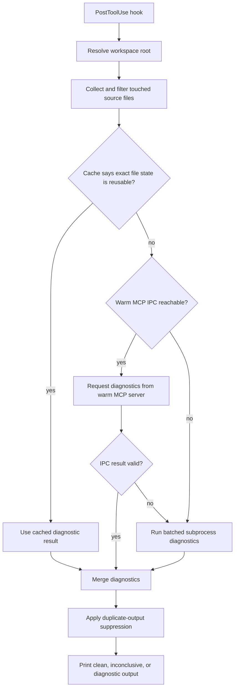

# Overhaul PostToolUse Diagnostics Latency

## Summary

This plan makes PostToolUse diagnostics prefer the fastest safe path: root normalization, exact-state cache hit, warm MCP IPC on cache miss, and batched subprocess fallback. The work is one integrated latency overhaul with internal checkpoints so each layer can be measured and verified before the next layer increases complexity.

---

## Problem Frame

The MCP server path keeps an `LspManager` alive for the Codex session, but the PostToolUse hook starts a fresh diagnostics subprocess for each touched file. Multi-file edits pay repeated Node and language-server cold-start cost, while single-file edits still pay one full cold start even when the MCP server already has a warm language server.

The objective is maximum hook latency reduction. Reliability still matters, but the plan intentionally accepts added IPC and cache complexity when measurement shows material latency improvement and the fast path fails open to visible diagnostics behavior.

---

## Requirements

**Latency routing**

- R1. PostToolUse diagnostics must check an exact-state cache after root/file normalization, then attempt project-scoped warm MCP IPC for non-cached files before starting subprocess diagnostics.
- R2. If IPC is unavailable, stale, slow to connect, or returns an operational error, the hook must fall back to a batched subprocess diagnostics path; root-boundary and trust-boundary violations must fail closed.
- R3. The fallback path must run at most one diagnostics subprocess per language group for touched files.
- R4. The hook must support conservative cache/skip behavior for exact repeated file states without suppressing diagnostics when project freshness is ambiguous.
- R5. The hook must measure baseline, cache-hit, IPC, and fallback latency so IPC/cache complexity is justified by observed wins.

**Correctness and safety**

- R6. Workspace root resolution must be stable when the hook runs from a subdirectory.
- R7. File filtering, IPC routing, and cache keys must preserve workspace-root boundaries.
- R8. Missing, timed-out, stale, unavailable, clean, and diagnostics-found states must remain visibly distinct.
- R9. Existing duplicate-output suppression must continue to suppress repeated output without preventing useful diagnostics work where freshness is uncertain.
- R10. Local IPC must include a trust-boundary handshake covering bridge version, normalized root identity, request schema version, and a per-process or per-session secret.

**Compatibility and operations**

- R11. Existing MCP tool names, schemas, and read-only semantics must remain backward compatible.
- R12. The IPC endpoint must avoid collisions across different project roots and tolerate normal MCP process exit.
- R13. The implementation must work on Windows named pipes and must not knowingly preclude future Unix-like socket support.
- R14. Documentation must describe the new hook routing, fallback behavior, measurement output, and environment controls for disabling IPC/cache and tuning IPC timeouts.

---

## High-Level Technical Design

The hook remains a command invoked by Codex. The speed path changes: exact safe cache hits skip diagnostics work, cache misses try to talk to the MCP server that Codex already started, and IPC misses fall back to a subprocess path that is still faster than today because it batches files by language.

---

## Key Technical Decisions

- **Exact cache precedes IPC:** The fastest safe path is an exact-state cache hit, but IPC remains the primary diagnostics execution path on cache misses.
- **Batched subprocess remains the reliability floor:** IPC failures should degrade to a tested local diagnostics path instead of making hook behavior depend on MCP lifecycle ordering.
- **Root normalization happens before routing:** Root identity drives file boundaries, cache keys, and IPC endpoint names, so it must be fixed before batching, cache, or IPC.
- **Cache is conservative and invalidation-heavy:** Cache entries should include root identity, hook payload identity, file identity, file state, relevant project fingerprint, language/config fingerprint, and bridge version; ambiguity should rerun diagnostics.
- **Diagnostics status semantics are preserved:** Performance changes must not turn timed-out or unavailable diagnostics into clean diagnostics.
- **IPC uses project-scoped endpoint names:** Windows named pipes use a flat namespace, so endpoint names should be derived from a stable hash of the normalized workspace root.
- **IPC is diagnostics-only:** The local endpoint may reuse shared dispatch helpers internally, but it should reject non-diagnostics requests for this plan.
- **Completeness changes are audit-only:** This plan can measure diagnostics freshness behavior, but language-specific quiescence changes require follow-on planning unless this branch introduces a regression.

---

## Implementation Units

### U1. Establish Hook Behavior Test Harness

- **Goal:** Add focused tests around the hook script before changing routing behavior.
- **Files:** `scripts/codex-lsp-post-tool-use.mjs`, `tests/post-tool-use.test.ts`, `package.json` if a helper script is needed.
- **Patterns:** Follow the direct Vitest style in `tests/package-contract.test.ts` and mocked provider style in `tests/transport.test.ts`.
- **Approach:** Split the hook into a thin executable wrapper plus testable helpers, or test the executable only through spawned Node processes with fixture stdin, env, and cwd; do not import a top-level script that calls `process.exit`.
- **Test Scenarios:**
  - Hook input with nested `file_path` values collects supported source files and ignores unsupported extensions.
  - Source paths outside the resolved workspace root are rejected.
  - Missing language servers produce the existing skipped behavior when verbose pending is enabled.
  - Clean, timed-out, diagnostics-found, subprocess-error, and duplicate-output paths preserve current output behavior.
  - `CODEX_LSP_HOOK_MAX_FILES` continues to cap touched files.
- **Verification:** `npm run test:run -- tests/post-tool-use.test.ts`.

### U2. Normalize Workspace Root Resolution

- **Goal:** Replace raw hook `process.cwd()` root assumptions with robust workspace-root resolution.
- **Files:** `scripts/codex-lsp-post-tool-use.mjs`, `src/index.ts`, possible shared helper under `src/core` or `src/utils`, `tests/post-tool-use.test.ts`, `tests/config.test.ts` if root detection touches config behavior.
- **Patterns:** Reuse existing workspace-root recognition from `src/index.ts` where possible and keep root-boundary checks consistent with `resolveFileInsideRoot`.
- **Approach:** Use a bounded `findWorkspaceRoot(start)` algorithm: explicit hook root/env when present, then upward git root, then nearest recognized package root, then cwd fallback; stop at the drive root and defer broader monorepo root redesign.
- **Test Scenarios:**
  - Hook run from a subdirectory resolves the repository root.
  - Relative touched files are resolved against the normalized root.
  - Absolute touched files inside the root are accepted.
  - Absolute and relative paths outside the root are rejected.
  - Non-git but recognized workspace roots continue to work for package-based projects.
- **Verification:** `npm run test:run -- tests/post-tool-use.test.ts tests/config.test.ts`.

### U3. Measure Baseline Hook Latency

- **Goal:** Establish the latency baseline and fast-path gates before committing to IPC/cache complexity.
- **Files:** `scripts/codex-lsp-post-tool-use.mjs`, optional benchmark helper under `scripts`, `README.md` if the measurement command becomes user-facing.
- **Patterns:** Keep benchmarks separate from correctness tests so CI does not depend on machine-specific timing.
- **Test Scenarios:**
  - Measurement captures cold single-file subprocess latency.
  - Measurement captures multi-file current subprocess latency.
  - Measurement captures warm MCP diagnostics latency where available.
  - Measurement reports cache-hit and IPC-overhead placeholders once later units add those paths.
- **Verification:** Manual Windows benchmark receipt recorded before U4 and updated after U5/U6; do not ship IPC/cache if measured wins do not clear documented gates.

### U4. Add Multi-File Diagnostics CLI and Batched Fallback

- **Goal:** Add a file-list diagnostics mode and change hook fallback from one subprocess per file to one subprocess per language group.
- **Files:** `src/index.ts`, `src/core/diagnostics.ts`, `scripts/codex-lsp-post-tool-use.mjs`, `tests/diagnostics.test.ts`, `tests/post-tool-use.test.ts`, `README.md`.
- **Patterns:** Reuse `collectDirectoryDiagnostics` aggregation logic where it fits, but keep touched-file diagnostics bounded to the provided file list.
- **Output Contract:** Multi-file diagnostics should return one JSON object with aggregate `status`, `timedOut`, `stale`, `total`, `bySeverity`, `items`, `files` per-file summaries, and `missingServers` accounting. Single-file `diagnostics --file` output stays unchanged.
- **Language Contract:** Hook fallback groups by bridge language and invokes diagnostics with `--language <language>`; mixed-language batches are split before invoking the CLI.
- **Test Scenarios:**
  - CLI accepts multiple files and returns the agreed aggregate object with per-file traceability.
  - CLI rejects mixed file/root inputs that escape the workspace root.
  - Hook groups touched files by detected language and starts one subprocess per language group.
  - Hook keeps missing-server accounting per language group.
  - Existing single-file `diagnostics --file` behavior remains backward compatible.
- **Verification:** `npm run test:run -- tests/diagnostics.test.ts tests/post-tool-use.test.ts tests/transport.test.ts`.

### U5. Add Diagnostics-Only Warm MCP IPC Server

- **Goal:** Let the MCP process expose a project-scoped local IPC endpoint for diagnostics batch requests only.
- **Files:** `src/transport/mcp.ts`, `src/index.ts`, new IPC helper under `src/transport` or `src/core`, `tests/transport.test.ts`, `tests/ipc.test.ts`.
- **Patterns:** Reuse diagnostics dispatch internally where safe, but reject non-diagnostics IPC requests so this does not become a second general MCP transport.
- **Handshake:** IPC requests must include bridge version, normalized root hash, request schema version, and a per-process or per-session secret known to the hook.
- **Test Scenarios:**
  - IPC server accepts a diagnostics batch request and returns structured content.
  - IPC endpoint name is stable for the same root and different for different roots.
  - IPC handshake rejects wrong root hash, wrong schema version, missing secret, and mismatched bridge version.
  - IPC server rejects or errors on malformed JSON-RPC requests without crashing.
  - IPC server rejects non-diagnostics requests.
  - MCP stdio behavior remains unchanged.
  - IPC listener shuts down when the MCP runtime is disposed.
- **Verification:** `npm run test:run -- tests/transport.test.ts tests/ipc.test.ts`; run a manual Windows smoke that starts MCP, sends one local pipe diagnostics request, verifies response, and disposes the server.

### U6. Route Hook Through IPC With Fast Fallback

- **Goal:** Make the hook attempt warm IPC diagnostics before batched subprocess diagnostics.
- **Files:** `scripts/codex-lsp-post-tool-use.mjs`, IPC helper files, `tests/post-tool-use.test.ts`, `tests/ipc.test.ts`.
- **Patterns:** Keep fallback behavior deterministic: connection failure, stale endpoint, timeout, parse error, or diagnostics operational error falls through to batched subprocess unless the error is a root-boundary or trust-boundary violation.
- **Budgets:** Define default IPC connect and response budgets before implementation so failed warm-path attempts do not add open-ended latency before fallback.
- **Test Scenarios:**
  - Hook uses IPC when a matching endpoint responds.
  - Hook falls back to batched subprocess when no endpoint exists.
  - Hook falls back when IPC connection times out.
  - Hook falls back when IPC returns malformed output.
  - Hook does not fall back on security, handshake, or root-boundary violations that should fail closed.
  - IPC responses preserve clean, inconclusive, and diagnostics-found output behavior.
- **Verification:** `npm run test:run -- tests/post-tool-use.test.ts tests/ipc.test.ts`.

### U7. Add Conservative Cache and Skip Layer

- **Goal:** Avoid diagnostics work for exact repeated file states without claiming semantic freshness across project changes.
- **Files:** `scripts/codex-lsp-post-tool-use.mjs`, possible cache helper under `scripts` or `src/core`, `tests/post-tool-use.test.ts`.
- **Patterns:** Preserve the current duplicate-output stamp as output-loop protection while adding a separate diagnostics-result cache for work avoidance.
- **Project Fingerprint:** For TypeScript and JavaScript, include relevant project files such as `tsconfig.json`, `package.json`, lockfiles, and configured language-server settings in the cache fingerprint; for other languages, include their closest config/dependency markers when present.
- **Gate:** Ship diagnostics-result caching only if repeated-edit measurements show a material win without increasing ambiguous-clean risk.
- **Test Scenarios:**
  - Unchanged file state reuses a cached diagnostics result.
  - File mtime, size, or content change invalidates the cache.
  - Bridge version or config fingerprint change invalidates the cache.
  - Missing cache entries rerun diagnostics.
  - Cache read/write errors fail open by rerunning diagnostics.
- **Verification:** `npm run test:run -- tests/post-tool-use.test.ts`.

### U8. Audit Diagnostics Freshness Semantics

- **Goal:** Determine whether the current publish-diagnostics revision wait can miss later TypeScript semantic diagnostics without expanding this plan into a diagnostics-completeness rewrite.
- **Files:** `src/core/lsp-semantic-provider.ts`, `tests/lsp-semantic-provider.test.ts`, `tests/typescript-integration.test.ts`.
- **Patterns:** Preserve `sourceRevision`, `timedOut`, and `stale` reporting; document any completeness gap and defer quiescence or language-specific completion changes unless this branch introduced the regression.
- **Test Scenarios:**
  - Diagnostics after `didChange` do not return a prior revision as fresh.
  - Timed-out diagnostics remain inconclusive and mark stale when applicable.
  - TypeScript integration records whether syntax and semantic diagnostics arrive in separate waves for a changed file.
  - Any observed gap is reported as a follow-on decision unless routing changes caused it.
- **Verification:** `npm run test:run -- tests/lsp-semantic-provider.test.ts tests/typescript-integration.test.ts`.

### U9. Documentation, Package Contract, and End-to-End Verification

- **Goal:** Document routing behavior and verify package/install surfaces include any new IPC or helper files.
- **Files:** `README.md`, `CONTRIBUTING.md` if workflow changes, `package.json`, `tests/package-contract.test.ts`, `.codex-plugin/plugin.json` only if hook registration changes.
- **Patterns:** Follow the package contract coverage in `tests/package-contract.test.ts`.
- **Test Scenarios:**
  - Package file list includes new runtime helper files needed by installed hooks.
  - README explains IPC-first, cache, and batched fallback behavior without overstating diagnostics as full type-checks.
  - README documents verbose path reporting for `cache`, `ipc`, and `subprocess`.
  - README documents environment controls for disabling IPC/cache and tuning IPC timeout.
  - Hook registration remains compatible with existing plugin metadata.
- **Verification:** `npm run ci:verify`.

---

## System-Wide Impact

- **Hook latency:** The fastest successful path becomes IPC to a warm MCP server. The fallback path is still faster for multi-file edits because it batches diagnostics.
- **MCP runtime:** The MCP server gains an additional local IPC listener while retaining stdio as the Codex-facing transport.
- **Local trust boundary:** IPC introduces a local endpoint, so handshake validation and diagnostics-only routing are part of the system contract.
- **Package surface:** Any new runtime helpers must be included in `package.json` `files` and covered by package contract tests.
- **Windows reliability:** Named-pipe behavior becomes a first-order part of the test and smoke matrix.
- **Failure semantics:** More routing paths increase the need to preserve status distinctions and root-boundary failures.

---

## Risks & Dependencies

- **MCP lifecycle ordering:** Codex may fire a hook before the MCP server is ready, so IPC must be opportunistic and fallback-backed.
- **Named-pipe edge cases:** Windows named pipes use a flat namespace, so endpoint names must be sanitized and root-hashed.
- **Local endpoint trust:** Root-hash naming prevents collisions but not unauthorized local clients, so the IPC handshake must include a session secret or nonce.
- **Cache invalidation:** A cache that ignores dependency, config, or version state can hide diagnostics. Fail open and rerun when in doubt.
- **TypeScript diagnostic batching:** The language server may publish diagnostics in multiple waves. The plan audits this before changing wait behavior.
- **Test realism:** Unit tests can validate routing, but a manual Windows smoke is still needed for named-pipe behavior.

---

## Acceptance Examples

- AE1. **Covers R1, R2.** Given no exact cache hit and the MCP server exposes the matching project IPC endpoint, when the hook receives a touched TypeScript file, then it obtains diagnostics through IPC without spawning a diagnostics subprocess.
- AE2. **Covers R2, R3.** Given no exact cache hit and no IPC endpoint is reachable, when the hook receives three TypeScript files and one Python file, then it starts one TypeScript diagnostics subprocess and one Python diagnostics subprocess.
- AE3. **Covers R4.** Given a file has the same cached state and the cache fingerprint still matches, when the hook receives that file again, then it reuses the cached diagnostics result.
- AE4. **Covers R6, R7.** Given the hook runs from a workspace subdirectory, when it receives a touched file at the workspace root, then it resolves the file against the workspace root and does not reject it as outside the current directory.
- AE5. **Covers R8.** Given diagnostics time out with no findings, when the hook prints output, then it reports the result as inconclusive rather than clean.
- AE6. **Covers R9.** Given two hook runs produce identical diagnostics output, when duplicate-output suppression runs, then the second output is suppressed without changing cache freshness behavior.
- AE7. **Covers R10.** Given an IPC request has a wrong root hash or missing secret, when the endpoint receives it, then it rejects the request without falling back as if it were an operational miss.
- AE8. **Covers R11.** Given existing MCP clients call `lsp_diagnostics` with `file`, `uri`, or `dir`, when the new diagnostics batch support ships, then existing inputs still return the same shape as before.
- AE9. **Covers R12, R13.** Given two different workspace roots, when their MCP servers start, then their Windows named-pipe endpoint names do not collide.
- AE10. **Covers R14.** Given verbose hook output is enabled, when cache, IPC, or subprocess paths run, then the output identifies the path and relevant fallback reason without claiming a full type-check.

---

## Documentation / Operational Notes

- Keep `CODEX_LSP_HOOK_MAX_FILES` as the safety cap until IPC and cache behavior are verified under manual smoke.
- Document IPC/cache disable switches and IPC timeout controls up front so operators can recover from a bad fast path.
- Document that clean file diagnostics are still not a full project type-check.
- Include a manual Windows smoke that starts `codex-lsp-bridge mcp`, runs the hook against a touched file, confirms IPC use, kills MCP, confirms batched fallback, and records latency for cache, IPC, and fallback paths.

---

## Sources / Research

- `scripts/codex-lsp-post-tool-use.mjs` currently collects touched files, caps at `CODEX_LSP_HOOK_MAX_FILES`, loops per file, and spawns `dist/index.js diagnostics --file`.
- `src/index.ts` currently supports single-file diagnostics and directory diagnostics, but not a direct touched-file list.
- `src/transport/mcp.ts` already exposes shared JSON-RPC request handling that IPC can reuse.
- `src/core/lsp-manager.ts` caches one semantic provider per language inside a process.
- `src/core/lsp-semantic-provider.ts` tracks diagnostics revisions, stale state, and timeouts.
- `tests/transport.test.ts`, `tests/diagnostics.test.ts`, and `tests/package-contract.test.ts` show the current Vitest patterns to extend.
- Node.js `net` IPC docs describe Unix domain sockets and Windows named pipes, including `\\?\pipe\` / `\\.\pipe\` pipe paths and process-owned pipe lifecycle: https://nodejs.org/api/net.html.
